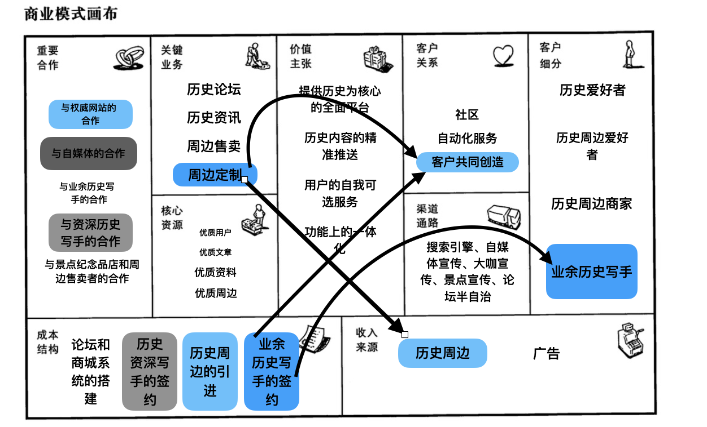
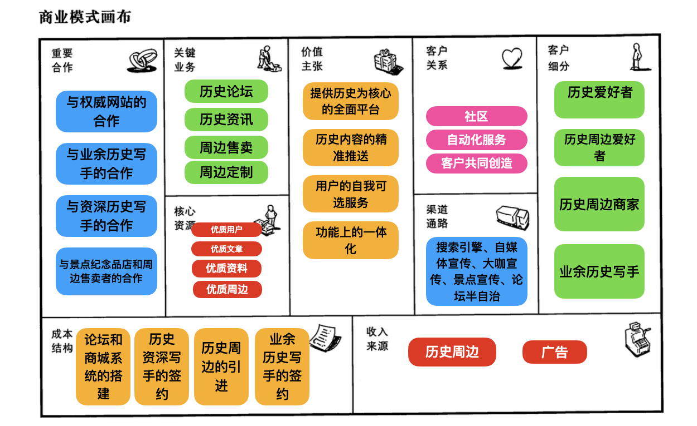

## 1.商业模式环境

> 四个方面的每个子方向都必须进行研讨，并回答教材在每 个子方向上列举的主要问题，回答这些问题时请先说明这些问题在你的商业模式与 业务领域内是如何体现的，再进行回答
>
>
> 教材上列举的商业模式环境里每个方面的每个子问题下的所有主要问题 都需要与你的商业模式结合，再进行回答

### 1.1 市场影响力：

#### 1.1.1 市场问题：

- 影响客户环境的关键因素

  - 体现：我们的价值主张中包括要以历史为核心构建全面的平台，提供历史文化氛围浓厚的环境，这种专一而简朴的主题正是历史爱好者们的核心需求。
  - 回答：
    - 如今网络论坛的风气较为混乱。
    - 网民素质良莠不齐。
    - 很难找到文化氛围浓厚的历史论坛。
- 现在正在发生什么转变
  - 体现：如今，人们愿意分享和讨论自己对文化的见解，并且愿意付费去享有更优质的服务，因此我们把用户的自我定制以及信息的精准推送作为价值主张的一部分，并通过历史论坛作为关键业务的一环。
  - 回答：
    - 人们越来越倾向于通过网络进行交流沟通。
    - 人们开始注重知识的付费以及付费服务的专业性。
- 市场在朝什么方向发展
  - 体现：我们注重与权威网站、自媒体、历史爱好者和历史商贩的合作，并以此推出可定制的咨询、论坛以及周边售卖服务，致力于发展以历史为核心的整套生态论坛。
  - 回答：论坛平台的环境和质量越来越受到重视，优质的文化氛围和服务质量越来越被消费者注重。

#### 1.1.2 市场细分

- 哪块客户细分群体最重要？

  - 体现：我们的客户群体主要分为：历史爱好者、历史周边爱好者以及历史商贩。我们认为三者缺一不可，但最重要的还是历史爱好者，他们是我们整个平台构建的根基。
  - 回答：
    - 历史爱好者：通过我们历史文化氛围浓厚的平台进行历史知识的分享讨论，交流独到见解。
    - 历史周边爱好者：对历史周边感兴趣的爱好者可以通过我们平台可以接触到很多带有独特文化内涵的历史周边。
    - 历史周边商家：专注于制作但缺乏良好的营销通路的商家可以依托于我们的平台销售出自己的优质历史周边。

- 最大的增长潜力在哪里？

  - 体现：历史爱好者作为我们的客户群体之一，无疑是最具有潜力的，我们优质的历史氛围会吸引他们在此讨论，带动平台运作，同时又会反过来提升我们的文化氛围。
  - 回答：论坛之中的历史爱好者，他们既是我们客户群体的核心，也是推动论坛氛围的主力。

- 哪个细分市场正在萎缩？

  - 体现：与商业模式画布中的客户群体相同

    回答：我们认为不存在正在萎缩的市场，无论是历史爱好者、历史周边爱好者还是历史周边商家，他们都是较为新兴的客户群体。

- 哪个边缘细分市场值得关注？

  - 体现：与商业模式画布中的客户细分相同
  - 回答：历史周边爱好者，这类群体也许在生活中对历史周边并不太了解，但是他们心中有对历史、对文化的热情和思考，因此当它们接触到优质的历史周边时会迸发出足够的热情。

#### 1.1.3 需要和需求

- 客户需要什么？
  - 体现：我们的价值主张明确要提供优质的以历史为核心的平台，以及用户的自我可定制服务等全方位一体化的功能，平台不仅仅注重客户的单一体验，而是想类似一条龙的方式为客户提供全面的服务。
  - 回答：
    - 历史文化氛围浓厚历史论坛
    - 高质量的可付费可选服务
    - 高度可定制的服务
- 没有被满足的客户需求里哪个最值得被关注？
  - 体现：平台的成本结构中，历史论坛的搭建占据了大量成本，因此我们可能会以广告的方式去弥补。
  - 回答：
    - 对广告的质量进行严格的审查，确保不会破坏论坛的浓厚氛围。
    - 对广告的形式进行严格的考虑，确保用户的使用体验。
- 客户最渴望满足的需求是什么？
  - 体现：价值主张中，我们明确论坛的优质性以及浓厚的文化氛围，就是希望在这个快节奏的社会下提供一片净土，一片世外桃源，让有兴趣的人们能够沉浸在这个氛围之中。
  - 回答：
    - 专业、浓厚的文化论坛
    - 优质、有深度的历史资讯及分析
    - 优质、可定制的付费体验
- 哪些需求在增长？
  - 体现：平台致力于提供优质的文化论坛以及可定制的全方位优质付费服务以满足人们如今差异化的购买力和购买需求。
  - 回答：
    - 浓厚的文化论坛氛围
    - 自由、可定制的付费服务。
    - 优质的商品和服务。
- 哪些需求在降低？
  - 体现：无
  - 回答：
    - 免费的、低质量的服务
    - 低门槛、缺乏文化核心的论坛

#### 1.1.4 转换成本

- 联系客户和公司及其产品或服务的纽带是什么？

  - 体现：平台提供高度可定制化的服务已经优质的资讯、氛围浓厚的论坛，给心中真正热爱历史、拥抱历史的人们以心灵的归宿，我们提供的是无可替代的精神上的慰藉。
  - 回答：
    - 极具特色的历史文化氛围
    - 自由可定制的历史服务

- 阻止客户投靠竞争对手的转移成本是什么？

  - 体现：同上一个问题
  - 回答：
    - 极具特色的历史文化氛围
    - 自由可定制的历史服务

- 客户找到和购买相似产品或服务的难度大吗？

  - 体现：能够提供非常优质的文化氛围的论坛目前还比较少见，以及我们平台的特色定制服务。
  - 回答：不容易，目前的几大主流论坛要么氛围不太好，要么没有定制化的服务，并且这些论坛都是面向大众群体，并且倾向于社交，我们的论坛是主打历史文化，和其他论坛有很大的区分度。

- 品牌的作用大吗？

  - 体现：平台的渠道通路中，客户会以搜索引擎、自媒体宣传、历史领域经营等多种方式和渠道了解到我们平台，我们要凭借我们自己平台的特色和优势建立良好的口碑，注重品牌效应。

  - 回答：

    我们的平台的核心还是历史文化，知识的质量和丰富度很难通过数值指标去量化，因此品牌效应也是我们平台能够吸引更多客户的关键因素。

#### 1.1.5 收益吸引力

- 让客户真正愿意掏腰包的是什么产品或服务？

  - 体现：平台的收入来源包括历史题材周边和广告费。当我们的论坛和历史周边真正拥有历史文化核心时，用户一定能够慧眼识珠。此外，我们高质量的用户自我可定制服务也一定能够收到许多人的青睐。
  - 回答：
    - 自我可定制服务
    - 优质的历史题材周边

- 什么产品或服务能获得最大的收益率？

  - 体现：收入来源包括广告费和历史题材周边的售卖，当我们的论坛逐渐发展壮大之后，用户的自我可定制服务和广告的收入应该是最可观的收入来源。

  - 回答：

    自我可定制服务、广告收入。

- 客户能轻而易举地发现和购买更为便宜的产品和服务吗？

  - 体现：我们的平台核心还是优质的历史文化论坛，而这一论坛是面向所有人开放的，因此门槛很低。

  - 回答：

    可以，当客户一开始走进我们的论坛时，即使不用付费也可以体验到良好的历史文化交流的氛围，并且基于我们的可定制服务，客户可根据自己的需求自由选择自己的服务。

### 1.2 行业影响力：

#### 1.2.1 谁是我们的竞争对手？ 它们的概况如何？
**1.我们的竞争对手有哪些？**

**体现：**在业务上和我们有重叠的公司都是竞争对手

**回答：**市场中的设计历史类内容的问答网站和论坛还有文创产品售卖平台都是我们的竞争对手。

**2.行业内的主要玩家是谁？**

**体现：**在问答、论坛市场或当前电商市场占有率大的公司

**回答：**在问答网站方面，知乎是我们最大的竞争对手，因为它不仅有很庞大的用户基数，用户粘性比较高，而且还吸收了很多优质的历史向内容产出者，我们主要业务之一的历史论坛和资讯、内容定制它都有涉足，而且目前在这一片市场上一家独大。此外，贴吧，nga等主流论坛类网站也是主要玩家，但是历史方向并不是它们的核心内容，而且用户数量或者活跃度不如知乎，影响力不如知乎。在文创产品售卖方面，国内主流电商网站如淘宝/天猫，京东，拼多多都是这个市场目前的主要玩家。

**3.这些主要玩家有什么优势和劣势？**

**体现：**主要竞争对手的价值主张，核心资源，客户关系，关键业务

**回答：**知乎，贴吧和nga网站的有点在于用户数量多，粘度较高，优质内容充足，但是用户之间的关系并不够融洽，在价值主张中并不能很好的体现用户自我定制，像是付费咨询等业务都并不成功，推送方面质量残次不齐。而主流电商网站同样是用户数量大，和许多物流公司有成熟的合作，但在它们业务中周边售卖并不是一个很核心的部分，不会得到特别的关注和优化。

**4.这些主要玩家聚焦于哪些用户？**

**体现：**上述软件的用户细分

**回答：**知乎主要针对国内的中学生、大学生等受教育程度高的群体，主打的就是高质量的问答和知识分享；贴吧、nga等论坛类网站的主要用户是一个个具有相同爱好的用户群体，这些群体成员大多是二三十岁的青年。由这些爱好者群体组成论坛网站的整个用户群体，小群体彼此之间相对独立。电商网站的用户主要是中年和青年，其中女性占比比较大。

**5.这些主要玩家的主要服务是什么？**

**体现：**关键业务

**回答：**问答类网站的关键业务都是提供一个网络社区来让用户互相交流，在此之上提供一定的会员服务和广告业务来，知乎在此之外还提供了付费资讯业务。而电商类网站提供的是一个网上售卖平台让商家和买家在上面进行交易，以及附加的物流，售后，投诉等服务。

**6.它们的成本结构如何？**

**体现：**成本结构

**回答：**这些网站主要成本都在于网站本身的运行和维护，以及专门负责审核监管的部门

**7.他们对我们的客户群体、收益来源和利润有多大影响？**

**体现：**对我们的客户细分，收益来源和利润带来的影响

**回答：**这些网站占有了很大的用户群体，知名度高，因此对我们来说，客户群体被挤占得比较多，在增加用户群体上需要做出更大的努力以寻求突破。同时因为初期的用户数量不多，知名度不高，网站的流量自然也不高，关键业务带来的营收利润也比较少。

#### 1.2.2 新进入者

**1.谁是市场的新进入者？**

**体现:**其他的问答网站或者论坛，以及其他的电商

**回答：** 目前没有听说过有新兴的问答网站或这论坛。在文创产品售卖方面，现在的新进入者主要是一些文创产品产出者自营的售卖网站或者微信商店。

**2.它们有什么优势和劣势？**

**体现:**核心资源

**回答（由于在论坛方面没有听说过比较有名的新进入者所以下面的问题回答文创售卖的新进入者）：**这些网站或者线上商户主要都是自产自销，所以在资源上自己掌握了货源，但是劣势在于它们基本上只关注自己的产品，商品种类较少，分散在每家商户各自的网站上，缺少整合

**3.他们的价值主张是什么？**

**体现：**新进入者的价值主张

**回答：**价值主张主要是提供第一手的贩卖，减少中间环节，降低价格。另一方面也提供了专门化的售卖平台，方便客户选择。

**4.他们聚焦哪些客户群体？**

**体现：**客户细分

**回答：**主要面向有文艺范的或者生活比较精致的青年

**5.他们的成本结构是什么样的？**

**体现：**成本结构

**回答：**他们的成本结构和我们在文创售卖部分的结构相同，都需要进行网站的运维以及进行产品的生产（代工）

**6.他们对我们的客户群体、收益来源和利润有多大影响？**

**体现：**他们业务和我们重合多少，会抢走多少潜在用户

**回答：**在售卖方面上业务完全重合，如果不进行合作必然会抢走一定数量的用户，但是抢走多少取决于各自产品的设计、质量等方面的比较。但是另一方面也能够和他们展开合作，在我们的网站上提供销售渠道，增加我们的收入和知名度。

#### 1.2.3 替代产品和服务

**1.哪些产品和服务能够替代我们的产品和服务？**

**体现：**由于我们服务横跨两个领域，所以考虑各部分有哪些可能替代我们的产品和服务

**回答：**知乎等问答网站在历史内容问答，历史内容资讯推荐上能够替代我们；在历史文创产品售卖上，淘宝等电商上的文创商户也能提供替代服务。

**2.它们的成本与我们相差多少？**

**体现：**成本结构

**回答：**回答网站和我们历史内容回答和资讯推荐上成本相似，都需要进行网站运维，内容审核和有痔疮作者的激励；而电商网站的成本结构和我们相差在他们不需要关注产品的生产（代工）环节；自营的文创电商不需要关注网站运维；只有有自己的网站且生产（代工）的电商和我们这部分的成本结构相同

**3.客户要切换到这些替代品有多容易？**

**体现：**客户切换的代价大吗，切换的可能性如何

**回答：**在历史内容的问答和推送方面，如果我们的社区建设符合预期，用户会习惯我们产品提供的更和谐的社区氛围以及专业性更强的回答，如果选择切换在体验上会下降，但是由于我们的推送产出者以及用户都有可能同时使用多个问答类网站，因此在内容获取上的损失不一定很大。在文创产品售卖方面，我们并不能提供大型电商平台提供的其他类型产品的售卖，因此用户更多的也只是在需要购买的时候考虑选择我们，切换的代价不大，而且可能性不小。

#### 1.2.4供应商与价值链上的其他厂商

**1.哪些是行业价值链中的关键玩家？**

**体现：**提供了网站服务器和CDN资源的公司，知名的历史内容提供者以及提供文创代工生产的大型公司

**回答：**腾讯云，华为云，阿里云等公司。内容产出方面目前做的比较大的都是一些自媒体工作者，有名的有b站up主小约翰可汗和史图馆等，在生产代工方面目前没有看到特别大的厂家

**2.商业模式有多依赖这些玩家？**

**体现：**这些公司是否会垄断我们某方面资源的供给，是否是我们的重要合作伙伴

**回答：**我们的网站必须要有这些互联网公司提供服务，依赖程度很大；内容产出方面虽然我们自己可以雇用一些专门的作者但是优秀自媒体工作者给我们提供带来的高质量内容以及他们自带的一些粉丝对我们来说也非常重要，依赖程度较大；而文创产品生产方面我们离不开代工厂家，但是不会特别依赖其中某一家，毕竟有不少备选项

**3.目前有无边缘玩家涌现？**

**体现：**边缘玩家的涌现会给当前行业格局带来较大改变同时给我们带来竞争

**回答：**目前没有观察到边缘玩家涌现

**4.哪一部分利润最高**？

**体现：**关键玩家当中谁的利润最高

**回答：**提供内容的自媒体利润最高，代工厂家和互联网公司虽然有一定利润，但是人力成本，设备成本也不少，利润率还是自媒体高

#### 1.2.5利益相关者

**1.哪些利益相关者会影响商业模式？**

**体现：**利益相关者的评价和行动会影响我们的声誉和业务，从而影响我们的渠道，客户和伙伴

**回答: **历史回答论坛业务方面是产出历史内容的作者乃至自媒体还有在社区建设中起到重要作用的高水平历史爱好者或历史专业人士，在文创产品售卖方面是拥有自己设计生产文创产品的商家

**2.他们各自的影响力如何？**

**体现：**这些相关利益者自身影响力有多大？在我们的业务中他们的影响力投射又有多大？

**回答：**历史内容产出者是我们获取高质量推送内容的关键渠道，在此之外他们和高水平历史爱好者在社群专业性氛围建设上起到了不可或缺的作用，而高水平历史爱好者能够在讨论区中产出宝贵的高质量内容。同时历史内容产出者能够带动一群粉丝关注我们的平台，高水平历史爱好者也能在其他的问答类网站中推荐我们，而且推荐效果强于一般的广告，在我们产品提升知名度和用户粘度的过程中起到主要作用，所以对我们来说他们的影响力很大。

​           而在文创产品售卖方面，那些拥有自主设计生产（代工）文创产品的产家能够为我们售卖文创产品的平台上带来更多的商品种类以提升售卖平台的吸引力。但是除去他们我们也有自己的产品，因此影响力虽然不小但不见得不可或缺。

### 1.3 关键趋势：

#### 技术趋势

##### 1.主要的技术趋势？

**体现：**平台与云服务提供商进行合作，在各地存储平台数据，提高数据容灾能力和访问速度

**回答：**NoSQL数据库的发展使得分布式技术逐渐成熟，SaaS逐渐成为主流，降低了平台部署和维护的成本

##### 2.重要的趋势和颠覆性的威胁

**体现：**大平台正在逐步扩展业务范围，使得一个平台能容纳更多的内容和分类，威胁到我们此类单一内容的平台的出现。

**回答：**一.知乎、B站等平台拓展内容范围，威胁到我们无更多用户基础的平台。二.平台的维护、成本和内容获得难度降低

##### 3.边缘客户采用

**体现：**边缘客户采用的技术可以作为参考和研究对象

**回答：**采用小程序或公众号经营此类社群

#### 行业管理趋势

##### 1.影响市场的管理趋势

**体现：**管理方式贯穿商业结构的关键业务中的社区和渠道通路中的论坛半自治

**回答：**市场管理趋向线上化和用户自主化，我们并不愿过多干涉用户和市场体验，我们主张用户自我探索以实现成果的自我监管

##### 2.影响商业模式的规定

**体现：**对于文章的管理和社群的运营会产生许多相关业务，以延申其成本结构

**回答：**随着法律和社会对于知识产权的意识提升，我们作为内容产出为主的产品，更应该关注内容其背后的作者所拥有的正当权利或者是否影响他人的正当权利，不仅如此，在开放性的社群中，我们也需注意个人数据隐私权的保密以及一些言论的正当性。

##### 3.影响客户需求的管理规定和税费

**体现：**作者的收入所得和创作收到规定和税费影响

**回答：**作者的创作所得需要经过税费的影响，以及其创作内容需要符合互联网的相关规定

#### 社会和文化趋势

##### 1.文化或价值观上的变化对商业模式的影响

**体现：**客户价值观影响其对平台的使用感受以及是否能够成为平台的客户，进而影响平台收入，以及是否愿意维护客户之间的关系

**回答：**

一个群体的文化是个体文化细分后的共相组合，首先，从社会层面上看，由于社会层面上生产力的不断发展，人们的精神需求不断上升，所以由人类本质需求所诞生的知识领域就收到主流文化的推崇，而文史哲领域的内容能被更多的社会大众所接纳，所以一个社会大众中大多数人所具有的文化倾向就反应为整体性的特征的变化，即使其中存在着部分人群对于其他领域知识的追求，也不能影响一个主流的倾向存在，所以我们得出结论即为目前的社会文化朝向着对文史哲领域研究的认可方向，而这使得社会大众在这样的文化氛围之下，更有可能或者说情感倾向上更愿意成为我们客户细分中的一员。

而从个体的层面上，我们的价值观鼓励交流，也支持对于一个知识输出者的尊重，并且随着近些年知识付费的不断出现，人们越来越认可对于创作者的物质上或者精神上的激励行为，所以我们平台中更能形成一个良好的客户关系之间的互动，平台也能从中获取到收入来源的增加。

##### 2.哪些趋势会影响用户的行为

**体现：**影响用户行为的趋势最终会体现在，平台中的客户关系以及平台的收入来源

**回答：**

1.知识付费理念的提升，和用户生活水平的提高会影响用户是否愿意为创作者提供收入的行为。

2.用户对于社区交流的需求逐渐的升高，尤其是对共同爱好者的社群交流。

3.用户对于产品的附加文化价值的认可，使得其购买我们的周边产品。

#### 社会经济趋势

##### 1.人口统计学趋势

**体现：**人口的组成结构和素质水平，会影响个体是否愿意使用我们的产品或者购买周边产品。

**回答：**国际劳工组织[2]：2022年全球失业人口总数预计将达到2.05亿人，全球失业率将达5.7%，大大超过2019年的1.87亿。失业人口的增加，说明社会闲散人员增加，更有可能解除我们的产品

##### 2.市场中收入与财富分布特征、消费特征

**体现：**财富分布和消费特征影响客户的购买和对创作者的反馈

**回答：**中等收入为市场中消费者的主流，人们普遍拥有能力购买价格合理的周边作为礼品或生活的装饰品，且以大学生为主流的消费群体正在不断增强知识付费的意识，青年人更愿意为创作者提供的知识付费。

### 1.4 宏观经济影响力：

#### **1.4.1全球市场情况：**
##### 1、经济发展处在蓬勃发展期还是萧条破败期？GDP增速是多少？

**体现：**全球经济萧条，增量经济转存量经济，意味着我们以有更高性价比的轻奢为定位的周边，会有更多的潜在用户

**回答：**受疫情影响，中国GDP增速[1]放缓2020年仅有2.3%，2021年也并无明显复苏趋势，三个季度GDP环比增速分别为0.2%，1.2%，0.2% 全世界主要经济体的增速都在放缓

##### 2、失业率是多少？

**体现：**社会总体失业率的增加，增加了对副业等临时收入的需求，这使得我们更有可能吸收到作为核心资源的优质用户

**回答：**受疫情影响，全球经济停滞，国际劳工组织[2]：2022年全球失业人口总数预计将达到2.05亿人，全球失业率将达5.7%，大大超过2019年的1.87亿。

##### 3、整体国家经济战略方针是？

**体现：**以内循环为主的战略方针，让我们的主要**收入来源**周边售卖较少受到外来文化的冲击，同时本土文化更适合内循环的经济

**回答：**[3]中央政治局会议中提及“当前经济形势仍然复杂严峻，不稳定性不确定性较大，我们遇到的很多问题是中长期的，必须从持久战的角度加以认识，加快形成以国内大循环为主体、国内国际双循环相互促进的新发展格局”

#### **1.4.2资本市场：**
##### 1、资本市场状态？融资的难度？融资的成本高吗？ 

**体现：**资本市场是否活跃直接关乎我们的历史论坛平台是否容易获得投资，能否快速扩张构筑基本产业链。

**回答：**疫情以来资本巨头对投资的态度越发谨慎，加上文创赛道本身的小众不友好不受资本欢迎[4]，我们的历史论坛融资难度越来越⾼，成本也越来越高。

##### 2、现在能否获得风投、创投、众筹、市场资本或信贷？

**体现：**能否获取足够的资金、现金流来⽀持平台的运作对于初创时期的平台十分关键。

**回答：**对于贷款而言，虽然在疫情期间国家加⼤了对小微企业的贷款规模、降低了贷款条件，但由于后期经营贷恶意挪用现象严重，加重了贷前调查的门槛[5]，对于抵押物较少的初创平台获取信贷（经营贷）相对困难。风投等其他融资手段如上文所说，在文创相关行业也不易获得。

#### **1.4.3大宗商品和其他资源：**
##### 1、大宗商品与资源的当前市场状态？

**体现：**大宗商品整体的价格会传导到我们的核心成本之一的周边生产成本上，低廉的成本是平台运营下去的关键，较高的PPI暗示着成本的上升

**回答：**2021年PPI快速增长[6]，从年初的100左右快速增长到10月的113.5，制造业整体成本上升，周边生产的成本必然受到影响。但同时有报告指出PPI呈见顶趋势[7]，利好未来的周边生产。

##### 2、获取商业模式运作所需要的相关资源容易吗？成本如何，价格趋势？

**体现：**核心资源（尤其是优质用户）是平台不断吸引轻度用户正反馈运营下去的关键，本身与写手的签约也是我们成本结构的一部分

**回答：**互联网拉新成本较高难度较大[8]，2019年阿里成熟的体系下也要80元/人，同时价格呈逐年上涨趋势。我们的历史论坛如果采取传统的正攻法恐怕难以为继，而应该从高粘度用户的方向着手。

#### **1.4.4经济基础设施：**
##### 1、所处的市场公共基础设施怎么样？你会如何描述交通、贸易、教育质量和接触供应商和客户的状况？

**体现：**线上售卖作为我们的主要销售渠道，需要良好的网络基建，同时客户审美喜好也与我们周边的销路好坏相关

**回答：**97%县城覆盖5G网络，中国5G走在世界前列[9]，意味着线上销售可以轻松地接触到我们的目标用户。文创消费额逐年升高，意味着客户对文化消费的接受度也在不断提高，利好我们的历史周边销售。

##### 2、企业所得税情况如何？

**体现：**税收会以隐式的形式参与到我们的成本结构中去，对小微企业的优惠税率能让初创平台更快的度过困难期

**回答：**财政部实施对小微企业普惠性税收减免[10]，对小微企业的收入大概按20%的税率征收所得税

##### 3、针对企业的公共服务如何？

**体现：**网络部分同上，此外电费、房租等公共服务同样隐式地构成我们的历史周边生产成本。

**回答：**互联网发展迅速，基本的云服务可以直接购置，而房租等成本有对中小企业的优惠政策[11]，利好初期发展

##### 4、当地的生活质量？

**体现：**文创消费并非必须消费，生活质量过低会影响产品销路

**回答：**2020年中国实现全面小康，生活质量有保证，主要社会需求转变为人民日益增长的对美好生活需要，而文化生活正是美好生活的一部分。

## 2.评估商业模式
### 2.1总体评估：

- 加分项
1. 我们的价值主张与客户需求一致，针对细分的各类客户都有我们对应的价值主张。
1. 我们能从规模经济之中获利，通过扩大平台规模，吸引更多用户，我们的平台各方面受益都会有所提高。
1. 我们的收入来源是可持续的，只要我们提供的服务持续优质，就会有优质客户选择我们，这样平台就一定会有收入。
1. 我们的服务构建在我们平台独特的文化核心之上，而我们的客户也是被我们的文化核心所吸引。
1. 我们的运营低成本、高效率。日常情况下，只需维护商场和论坛，运营压力比较小。
1. 竞争对手很难复制我们的核心资源：我们的核心就是历史文化，而这一点是需要沉淀和生根发芽的，我们的平台优势就是这一点，其他平台很难达到相同的文化高度。

- 减分项

1. 我们的利润率较低，主要来源于广告、定制化服务以及历史周边售卖收入。
2. 我们的初期成本较大，并且需要有客户数量的保证才能有收入。
4. 我们的收益无法预测。我们的一切收入都构建在一个比较大的客户数量之上，但我们难以预测这个数字。
6. 我们起步时用户基数小，历史论坛的内容会很少。

### 2.2SWOT分析:

| 评估项目      | 评估内容                                 | 打分 | 理由                                                         |
| ------------- | ---------------------------------------- | ---- | ------------------------------------------------------------ |
| 价值主张评估  | 我们的价值主张良好匹配了客户的需求       | 4    | 我们为历史爱好者提供了更和谐，更专业化的交流平台，对于给用户的推送也持宁缺毋滥的态度，对于查询资料也提供了两种不同的方式，让用户能够选择更加方便的手段，尽可能地营造良好的社区环境和用户体验。对于想要购买文创产品的用户也提供了优质和设计感好的产品。而不足之处在于我们的平台用户预期并不会太多，在讨论话题和商品种类的多样性上可能会有所欠缺。 |
|               | 我们的价值主张有网络效应                 | 5    | 我们的产品的价值主张之间联系性很高，内容定制，一体化以及精准推送都需要在我们的以历史为核心的全面性平台上，并且它们之间彼此联系紧密 |
|               | 我们的产品和服务是强耦合的               | 5    | 我们业务的两大部分——问答和文创平台通过历史主题紧密联系在一起，而问答平台内部不论是论坛部分还是推送部分都以历史为主题，所有的服务和这个平台都是强耦合的 |
|               | 我们的客户很满意                         | 4    | 我们尽力为用户营造优质的社区环境，便捷的用户操作和良好的用户体验，用户满意度应该比较高，但是正如前面所言美中不足之处是用户数量不一定很大，所以在内容的全面性上可能让用户觉得美中不足 |
| 成本/收入评估 | 我们有很高的利润                         | 2    | 按照预期我们的主要收入还是售卖文创产品以及广告收入，会员制并不会作为主要的营销手段，而我们的产品预期用户数量并不会太大，在广告市场比较饱和而文创产品本身偏小众的情况下不见得能够创造很高的利润 |
|               | 我们的收入是可以预期的                   | -3   | 广告费取决于我们网站用户数量的多少，什么时候具有多少用户实在是难以预期，至于售卖文创产品，可能在双十一等大型购物活动时比较高，但是一般来说波动也可能比较大，至于用户会员订阅就更不可能在连有多少用户的情况下去估计了 |
|               | 我们有很多经常性收入，有很多回头客       | 4    | 广告费虽然不会一直拿一家公司的广告费但是也可以做到经常性的收入广告费，文创产品质量和设计感高，用户体验好，以后更可能再次购买 |
|               | 我们的收益来源是多样化的                 | 4    | 我们的收益并不单一，有广告，贩卖文创产品和提供会员服务等多种来源 |
|               | 我们的收益来源是可持续的                 | 3    | 用户会比较喜欢我们产品的氛围，因此通过一定的激励机制（如发放奖券等）让论坛区用户转而尝试购买文创产品并不是难事，而购买会员的用户感受到良好的用户体验之后也更可能有意愿继续购买；同样地，购买文创的用户前来使用论坛区从而增加知名度，提高一定的广告收入也并不是难事，所以从产品延伸开到生活方式也是可行的 |
|               | 我们在支出成本之前就有收入进账           | -4   | 搭建平台，雇用审核，运维，写作人手都是我们的产品推出之前必须完成的事情，不太可能在支出成本之前就能有进账 |
|               | 客户真正想买的就是我们提供的             | 4    | 我们提供了周边购买，会员，咨询等围绕历史主题的一系列产品和服务，能够尽可能提供用户想要的东西 |
|               | 我们的定价机制能够抓住客户全部的购买意愿 | 4    | 我们打算提供合理的定价。考虑到文创购买用户大多是收入并不会太多的学生群体和青年用户，我们不计划将文创产品的价格定的过高，同时会员制和付费咨询由于市场因素也不可能定出很高的价格，所以总体而言我们产品定价比较亲民 |
| 基础设施评估  | 竞争对手很难复制我们的核心资源           | 1    | 理论上来说，知乎和贴吧等网站本身已然具有许多的优质用户，优质内容产出者，以及他们产出的优质文章，而想要寻找开源的历史资料也不是难事，只有我们自己的文创产品是竞争对手不好复制的东西 |
|               | 资源的需求可以预测                       | 4    | 文创产品具体需求多少不好预测，但此外优质内容和服务器资源根据当前用户数量还是能够比较准确地预测的 |
|               | 我们在正确的时间部署了合适的资源         | 5    | 正常来说不太可能会有很大量用户在短时间内涌入，文创产品除了在双十一这种购物节以外也不大可能激增。所以服务器资源部署能做到按照需求合理部署，文创产品在预期的旺季淡季适当调整也能做到合理分配，况且文创产品一般可以长期储存，浪费的可能性较低 |
|               | 我们有效地执行了关键业务                 | 4    | 我们对于论坛环境的管理和引导投入很大的精力，积极寻求与优质历史内容产出者合作，丰富我们的优质内容，对于文创产品也力求良好的设计感和质量 |
|               | 我们的关键业务很难被复制                 | 1    | 论坛建设和内容产出上并不存在复制难度，相反，在很大程度上我们的优质内容产出者是跟其他问答类网站共享的，所以理论上其他问答类网站只要想做也可能可以复制，但是复制效果如何得看他们是否愿意花不小的成本在这上面。而市面上的优质的文创产品也不少见，同时我们也会卖友商的产品，因此复制难度也不会太大。 |
|               | 执行质量很高                             | 5    | 通过上述的大量投入以及更贴近用户的理念，能够做到很好地执行关键业务 |
|               | 我们的自有活动和外包活动达到了理想的平衡 | 4    | 在论坛内容方面我们的优质文章有不小的一部分需要外包给优质内容产出者们，同时我们也会有自己雇用员工进行内容产出，达到一种平衡，而在文创产品生产当中我们不可能购买一条生产线生产，必须把这部分生产工作外包出去。而平台上的文创产品一部分是我们自己的，一部分是友商产品，也能达成平衡。 |
|               | 我们很聚焦并且在必要的时候与伙伴合作     | 5    | 不论是在论坛内容方面我们非常需要和已有的优质内容产出者进行合作，这也是我们主要的努力方向之一，而在文创售卖中我们也会尽可能联系友商提供平台为他们售卖，实现双赢 |
|               | 我们与重要合作伙伴的关系很融洽           | 4    | 在论坛业务中我们为了留住合作伙伴必须和他们维持融洽的合作关系，但是在文创售卖上可能会跟合作伙伴产生一定的利益冲突，可能做不到一直保持融洽。 |
| 客户界面评估  | 客户流失率很低                           | 4    | 我们的核心业务实现质量高，客户满意度也高，但是也要关注到我们用户数量没那么大，论坛讨论的多样性和商品的多样性都会存在不足，因此虽然用户黏度会比较高，但也会有一定的用户流失率 |
|               | 客户群被很好地分类                       | 2    | 大致上我们能将用户分类成历史爱好者，历史周边爱好者和周边商贩，但是这些群体之间也很容易相互转换，做不到界限分明 |
|               | 我们不断地获得新的客户                   | 4    | 通过优质内容产出者的引流和推荐，我们能比较有效地不断获取新用户，但我们毕竟是一个偏小众的平台，获得的用户数量不会太大 |
|               | 我们的渠道很有效率                       | 4    | 自媒体宣传和高水平历史爱好者宣传带来新用户的可能性大         |
|               | 我们的渠道有很好的效果                   | 4    | 我们既使用搜索引擎推荐，互相宣传协议这种广撒网的方式，也有高质量自媒体宣传和高水平历史爱好者推荐这种精准有效的方式，能够起到较好的效果 |
|               | 渠道连接客户的能力很强                   | 4    | 搜索引擎和用户的连接多而紧密，对于历史爱好者小圈子内部，通过自媒体和高水平用户的推荐也可以高效地连接起来 |
|               | 客户能够轻易地看到我们的渠道             | 5    | 搜索引擎推荐，互相宣传协议都能做到让大量客户关注到我们的产品，对于不关注前两者的客户，我们也有高质量自媒体和高水平用户推荐，进一步提高客户关注的可能性 |
|               | 渠道被高度整合                           | 3    | 我们的渠道在线上线下都有，线上线下部分内部整合程度都比较不错，但是两个部分之间整合并不一定很好 |
|               | 渠道产生了规模经济                       | 3    | 我们的产品总体而言还是偏向小众的产品，在用户增加到一定程度之后涨幅会下降，只有文创产品售卖部分能够不断扩大流量 |
|               | 渠道良好匹配了客户群体                   | 4    | 在我们的设计中，我们的渠道就贴合了国内历史爱好者大多数可能接触到的渠道，完全站在历史爱好者获取信息的角度，但对于历史周边贩卖者了解渠道的关注有所欠缺 |
|               | 客户关系很强                             | 5    | 客户之间的氛围很融洽，我们自身也投入不少资源和用户建立有效沟通，了解用户诉求 |
|               | 关系质量正确地匹配了客户群体             | 4    | 我们提供了用户定制服务，建立了优质的社区，符合我们专业性较强，水平较高的用户群体的特点 |
|               | 客户的切换成本很高，客户和我们绑定了关系 | 3    | 用户切换本身不会太难，但是考虑到社区环境，人性化定制等方面，也具有一定的切换成本 |
|               | 我们的品牌很强                           | 5    | 我们主打的就是高体验高口碑，能够有效打造出自己的品牌         |

### 2.3S&W：

### 2.4O&T：

#### 2.4.1评估威胁：

| 评估项目         | 评估内容                                               | 打分 | 理由                                                         |
| ---------------- | ------------------------------------------------------ | ---- | ------------------------------------------------------------ |
| 对价值主张的威胁 | 存在可替代的产品和服务吗？                             | -2   | 我们存在历史周边贩卖的竞争对手，但由于我们根植于历史论坛的建设与用户粘性，我们的产品和服务具有一定的不可替代性 |
|                  | 竞争对⼿会爆出更有竞争力的价格，或者提供更好的价值吗？ | -3   | 强有力的对手可能有更好的上下游关系，从而给出有竞争力的价格   |
| 成本/收入        | 我们的利润受到竞争对手的威胁吗？是技术原因造成的吗？   | -1   | 我们的利润主要来源于周边的售卖，和推广收费，推广部分可能受到竞争对手流量优势的打压，不是技术原因造成的。但周边售卖的核心在于自研的高品质，不太受影响。 |
|                  | 我们过多地依赖某一项或多项收益来源吗？                 | -3   | 我们过多地依赖周边售卖、推广收入                             |
|                  | 未来有哪些收益来源会消失？                             | -1   | 广告费收益来源可能会消失，其他基本固定，但广告费本来比重也有限。 |
|                  | 哪几项成本会变得无法预测？                             | -2   | 随着优质用户的争夺红海化，激励用户创造内容的成本会变得无法预测 |
|                  | 那些成本的增加会快过它们所支撑的收入？                 | -3   | 前期基础生产设备购置的时候，生产周边的成本会快过它们支撑的收入 |
| 基础设施         | 我们会面临某些资源的供应短缺吗？                       | -3   | 整个制造业面临招工难，人力资源可能短缺                       |
|                  | 资源的质量能保证吗？                                   | -4   | 在扩张规模的途中无论是用户还是周边的质量都不可避免会有下滑   |
|                  | 哪些关键业务会遭遇中断                                 | -3   | 用户质量下降会打扰历史论坛的建设 周边质量下降会打扰周边售卖的收益 |
|                  | 我们的活动质量会受到威胁吗？                           | -2   | 我们依赖于整体有活力的论坛氛围，论坛的过期将对整个活动正反馈链条造成威胁 |
|                  | 我们可能失去哪些合作伙伴                               | -2   | 如果与历史爱好者、地方周边商贩的利益分配洽谈不当             |
|                  | 我们的合作伙伴可能和竞争对手合作吗？                   | -1   | 专职历史论坛本身比较稀缺，传统周边贩卖体系也不需要优质用户   |
|                  | 我们是不是过分依赖某些伙伴                             | -2   | 优质用户和地方周边商贩有很好的可代替性与流动性               |
| 客户界面         | 我们的市场可能迅速饱和吗？                             | -1   | 文化需求没有明确的上限                                       |
|                  | 我们的竞争对手是否威胁到我们的市场份额了？             | -3   | 根据前期调查，博物院文创等老牌文创对手会对我们的市场份额产生威胁 |
|                  | 我们的客户会如何弃我们而去                             | -2   | 论坛的内部亚文化粘性加上精致的周边贩卖定位，用户不太可能离开 |
|                  | 我们所在市场的竞争会以何种速度加剧                     | -3   | 本身行业并没有多少技术门槛会快速加剧竞争强度，但是建设论坛的用户社群先发优势可以一定程度让我们走上避开竞争的赛道。 |
|                  | 我们的竞争对手威胁到我们的渠道通路了吗                 | -1   | 我们的竞争对手基本注重与自媒体宣传和周边销售上，与我们对论坛的建设不冲突 |
|                  | 我们的渠道通路是否处在被边缘化的境地                   | -1   | 我们的渠道通路覆盖线上线下，线上是时下热门的自媒体，线下是游客必经之路的景点，基本不会被边缘化 |
|                  | 我们的某些客户关系是否可能恶化                         | -2   | 我们本根的营利性可能会打消客户自发性公益性的论坛自治积极性   |

#### 2.4.2评估机会：
| 评估项目  | 评估内容                                                     | 打分 | 理由                                                         |
| --------- | ------------------------------------------------------------ | ---- | ------------------------------------------------------------ |
| 价值主张  | 我们可以将产品转化成服务来获得重复增加的营收吗？             | +4   | 论坛生产的内容可以进多媒体联动重复增加营收                   |
|           | 我们能更好地整合我们的产品或者服务吗？                       | +3   | 各个关键业务成熟后可以整合成一个完整的生态圈                 |
|           | 我们还可以满足哪些额外的客户需求                             | +3   | 客户参与到周边设计的兴趣                                     |
|           | 还存在与我们价值主张互补或者是其延伸的东西吗？               | +2   | 历史专业学科教育                                             |
|           | 在服务客户的过程中，我们还可以为客户做哪些其他工作？         | +2   | 为历史周边提供更多的文化蕴涵，提供类网易云式的精神共鸣       |
| 成本/收入 | 我们可以将一次性交易收入转换成经常性收入吗？                 | +1   | 可以考虑出会员限定优惠，甚至会员限定周边，但不太好平衡原有的客户关系 |
|           | 还有什么产品或服务是客户愿意付费的吗？                       | +2   | 专业历史知识订阅，历史相关付费咨询                           |
|           | 在我们内部或者合作伙伴那有没有交叉销售的机会                 | +5   | 和地方周边商贩可以进行交叉销售的合作                         |
|           | 我们还能增加或创造出其他的收入来源吗？                       | +2   | 可以考虑进行会员化给与限定优惠，限定周边，但不太好平衡原有的客户关系，也没有足够吸引人的价值主张 |
|           | 我们能否提高价格                                             | +4   | 季节限定、节日限定可以推出相应高价周边                       |
|           | 我们在哪个环节可以缩减成本                                   | +3   | 产线外迁、利用垄断地位和用户/商贩签订优势合同                |
| 基础设施  | 我们能否在保持相同结果的同时，使用成本更低的资源             | +3   | 其实用户对优质的要求并没有这么高，适当下调标准，可以提供更工业化的历史资讯和周边 |
|           | 哪种核心资源从合作伙伴那获取效果会更好些                     | +2   | 优质周边如果能够从第三方获取会减少经营的风险                 |
|           | 哪种核心资源没有得到充分利用                                 | +0   | 貌似没有                                                     |
|           | 我们有没有什么未使用过的有价值的知识产权吗？                 | +1   | 可以考虑签霸王条款把用户创造内容的知识产权侵吞               |
|           | 我们可以对某些关键业务实施标准化流程吗                       | +3   | 周边售卖可以标准化，（第一方）历史资讯也可以周报月报的形式做粒度和内容的标准化 |
|           | 我们该如何从整体上提高效率                                   | +2   | 增加激励用户创造内容的力度                                   |
|           | IT技术支持能够提高效率吗？                                   | +2   | 更友好的文字编辑器可以提高效率                               |
|           | 是不是存在一些业务外包的可能                                 | +5   | 我们所有的关键业务都可以进行一定程度的外包                   |
|           | 与合作伙伴更深入的合作是否有助于我们更专注核心业务           | +3   | 合作伙伴分担平台在论坛建设与优质周边生产的压力越大，我们越能够着重于客户体验上的优化，以及商品本身的分销 |
|           | 在我们与合作伙伴的关系中存在交叉销售的机会吗？               | +3   | 同前述                                                       |
|           | 我们合作伙伴的渠道通路可以帮助我们接触客户吗                 | +3   | 游客本身就更可能对历史周边/历史论坛感兴趣                    |
|           | 我们的合作伙伴能够补充我们的价值主张吗？                     | +2   | 如果建立与地方景点、周边商贩深度合作可以增加线下体验历史的价值主张 |
| 客户界面  | 我们应该怎样利用日益壮大的市场？                             | +2   | 多媒体联动，IP化经营                                         |
|           | 我们能服务新的客户细分群体吗                                 | +3   | 论坛只要分版块辅以推荐算法就可以虚拟上分离不同的客户群体     |
|           | 我们能通过更为精细的客户细分群体来更好地服务客户吗？         | +3   | 对不同版块的用户进行画像描摹自然能对生产什么内容，以及推荐什么周边有所裨益 |
|           | 我们该如何改善我们渠道同路的效率和效能？                     | +2   | 增加和已有渠道的联动，同时强调自己历史主题的罕有性           |
|           | 我们能更好地整合我们的渠道通路吗?                            | +2   | 各个渠道通路（网络）之间可以设置友链                         |
|           | 我们能在合作伙伴那发现与我们的渠道具有互补性的渠道通路吗？   | +4   | 地方商贩可以更多发展对热爱户外的线下客户，与我们主打线上的渠道互补 |
|           | 我们可以直接服务我们的客户来提高我们的利润率吗？             | +1   | 不太能，历史证明知识付费死路一条，而贩卖周边这点很难通过直接服务客户来提高 |
|           | 我们能否更好地平衡渠道通路与客户细分群体之间的关系？         | +1   | 增加对客户的回访来进行针对性平衡                             |
|           | 在针对客户的售后服务上，还有什么改进的空间吗？               | +3   | 通过抽奖发优惠券等方式鼓励客户进行评价等售后服务             |
|           | 我们应该如何加强我们与客户之间的关系？                       | +3   | 举办一些定期的社区活动，线下活动，并给予荣誉/周边/现金作为奖励 |
|           | 我们能在服务的个性化上加以改善吗？                           | +3   | 价值主张中的用户自我可定制可以增加一些UI、字体上的个性化定制 |
|           | 我们应该怎样来提高客户的转移成本？                           | +2   | 通过客户自创造内容的集合，增强社区认同，打造“家”而不是“商场”的论坛氛围 |
|           | 我们是否已经发现并放弃了不能为我们带来收益的客户？如果没有，为什么？ | +2   | 没有，因为我们的整体服务兼容没有收益的客户并不需要付出太多的额外成本，留存更多用户可以带来更大的流量可能，也增强未来运营转型的可能性 |
|           | 我们需要自主化一些关系吗？                                   | +1   | 可以考虑引入AI客服，但会冲淡论坛的自治氛围                   |

## 3.蓝海战略

### 探索成本的影响

* 删除： 与自媒体的合作、历史周边制作的成本
* 削减： 与历史科普者的合作、历史（资深）写手（科普者）的签约的成本
* 提升：与权威网站的合作、历史周边的引进
* 创造：与业余历史写手的合作、历史周边定制的业务

-  首先，我们认为与自媒体的合作伙伴关系、与历史科普者的合作关系以及历史周边制作的成本这三个方面成本都较高。
  - 对于自媒体来说，他们给我们提供的推送平台、优质文章等资源可以被我们本身的渠道通路以及关键业务所取代。
  - 对于历史科普者来说，他们的知识文化水平普遍较高，因此和他们的合作签约的成本也势必较高，但是他们的产出文章又是提升我们平台核心文化竞争力的关键因素。因此我们选择降低一部分历史科普者/历史专家的签约成本，在保留我们文化核心竞争力的同时，尽可能降低平台运营的成本。
  - 对于历史周边制作来说，我们的平台主要提供的还是一个文化交流的环境和氛围，以及全方位的历史文化服务，优质的历史周边对我们来说也是生态中的重要一环，但我们仔细考虑，发现自己来承担历史周边的制作服务的受益不是很高，因此我们决定放弃自己的历史周边制作服务。
  
- 对上述三方面的成本项进行削减或删除之后，我们整体的平台运营成本会有所降低和浓缩，更能“把钱花在刀刃上”，但同时，我们的整体服务质量也会不可避免地下降，因此我们要进行下面的替代措施。
  - 第一点，我们将要和业余的或者无固定平台的历史写手合作，我们作为线上社区拥有优质的用户资源、可以为其提供合适且能展示其输出内容的平台。这样我们可以收获平台特有的作者，且也能在合作的历史写手的社交圈中起到宣传的作用。同时，业余写手的合作签约可以弥补我们削减掉的与历史科普者/历史专家的合作带来的负面影响，将原本一些更加专业和深度的内容被更符合大众口味，门槛较低的内容所替换，我们认为这样能够促进大众之间优质的文化交流。此外，这些业余写手一方面可以在我们的平台中发表优质内容，另一方面也是我们论坛的普通用户，这样更能体现我们“客户共同创造的”客户关系，可谓是一举多得。
  
  - 第二点，我们要提升与权威网站的合作以替代原来的自媒体及部分历史专家所提供的优质资源，我们认为权威网站中的内容质量可以与自媒体/历史专家所提供的内容质量相提并论，同时由于权威网站内容获取的便捷性，我们认为这样可以在保证我们整体内容质量的同时，降低我们的成本。
  
  - 第三点，我们要提升历史周边的引进以及创造出新的历史周边定制业务。
  
    历史周边定制业务的引进是因为单向的输出可能使得用户不感兴趣而流失，周边售卖也是同理，若无用户所想要的相关周边，用户可能不再使用我们的产品，所以我们提倡读者或买家提出自己的需求，读者可以通过作者设定的相关费用向作者订稿，请作者写相关内容的文章，同样买家如果在商城中无法找到自己想要相关的历史周边，可以向对应的商家提出需求，进行周边的定制。提供这样的渠道可以避免运营去试探用户到底需要什么，而是让用户自己提出来，并且提供点对点的交流渠道，使得其交流更加便捷，一个社区中输出者与接收者的联系也更加紧密，社区内容也会在这样的驱动下变得越来越丰富，逐渐弥补平台一开始可能会缺失的部分内容，也激励了作者和卖家的创作。加入了历史周边的定制之后，配合我们之前的全面平台、内容精准推送，我们的平台将提供更为全面的以历史文化为核心的服务，更能让客户体验到完整的历史氛围。这些变化对成本的影响只有后台系统的升级，其他方面并不会带来太多的成本开销。此外，引入了业余写手的合作，也就加强了我们和普通用户的合作，加强了我们客户关系之中的客户共同创造，并且更能体现我们价值主张中的用户自我定制的观念。
  
    而提升历史周边的引进是为了平衡一部分我们删除自己的历史周边制作所带来的影响。
  
    

## 4.更新过的商业模式画布

### 4.1 更新过后的商业模式画布

### 4.2 概述

商业模式画布中发生变化的地方有：

- 客户细分

  增加了业余历史写手

- 重要合作

  - 增加了与业余历史写手的合作
  - 删除了与自媒体的合作

- 成本结构：

  增加了业余历史写手的签约

- 关键业务：

  增加了周边定制
  
  

### 4.3 新加入或修改过的模块要点与模块之间的依赖关系

- 新增的“客户与商家的直接服务”这一价值主张，隐含了更优质内容的诉求，需要新的客户细分—增加了业余历史写手，进行新的重要合作—与业余历史写手的合作，引入了新的成本结构—业余历史写手的稿费，这三个新增要素相互关联，共同为产生优质内容以及营造更好的论坛自治氛围服务
- 收入来源的扩充是针对上述三个模块的综合效益，通过打赏的机制激励写手的创作，同时我们对打赏进行抽成

## 引用列表：

[1].国家统计局GDP信息 https://data.stats.gov.cn/search.htm?s=GDP%20%E5%A2%9E%E9%80%9F%202021

[2].国际劳工组织数据：https://baijiahao.baidu.com/s?id=1701467607513170734&wfr=spider&for=pc

[3].2020年 中央政治局会议内容 https://baijiahao.baidu.com/s?id=1673787170081204289&wfr=spider&for=pc

[4].中国经济网 我国文化创意产业融资困境与出路 https://baijiahao.baidu.com/s?id=1709752010342621358&wfr=spider&for=pc

[5].中国银保监会关于服务煤电行业正常生产和商品市场有序流通保障经济平稳运行有关事项的通知 http://www.cbirc.gov.cn/cn/view/pages/govermentDetail.html?docId=1011374&itemId=861&generaltype=1

[6].中国PPI指数 https://data.eastmoney.com/cjsj/ppi.html

[7].中国经济网 《大宗商品价格回落 PPI涨幅见顶信号浮现》 https://baijiahao.baidu.com/s?id=1717263274532574419&wfr=spider&for=pc

[8].互联网公司们陷入囚徒困境 获客成本越来越高 https://www.sohu.com/a/304376706_538698

[9].97%县城覆盖5G网络，中国5G走在世界前列 https://baijiahao.baidu.com/s?id=1717272032664359865&wfr=spider&for=pc

[10]. 2021年小微企业所得税优惠政策 http://www.creditsailing.com/ShuiWuZhengCe/745503.html

[11]. 降成本、调税收、减房租……这个制造业大市18条措施来了！27万家中小企业受益 https://baijiahao.baidu.com/s?id=1658428690859032166&wfr=spider&for=pc

