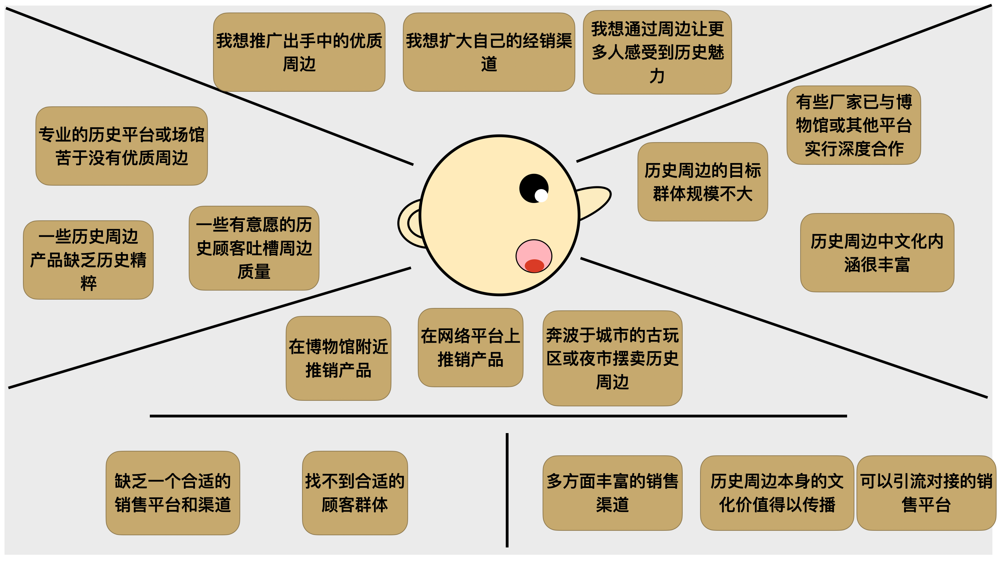
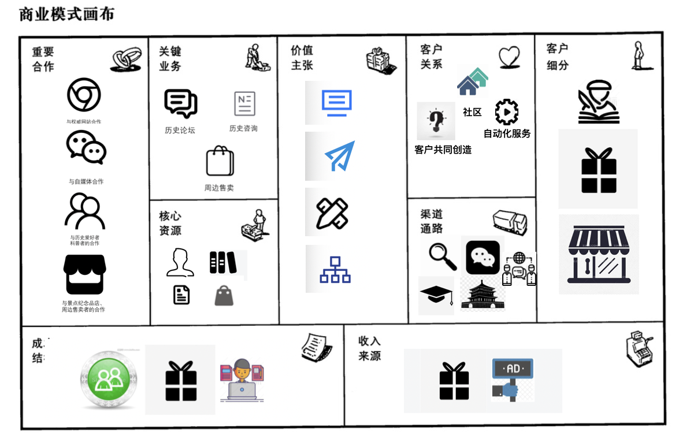
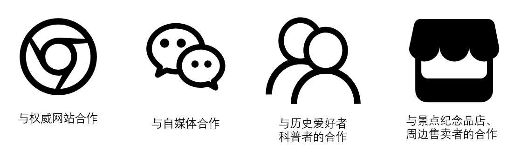

# 第二次作业

## 小组成员：

- 陈家志 191250009
- 陈家伟 191250008
- 林均劼 191250084
- 张潮越 191250190

## 简介：

本阶段工作注重于商业模式设计

## 度量数值：

客户洞察移情图：4

构思候选创意：4

引用调研报告和新闻：12

更新后画布：33个要点不少于30个，15个联系 不少于15个

故事数：5（1个公司视角）

场景部分要点：6

## 一、客户洞察：

### 1. 想挑选礼物的人：

**想与感受：**

- 手头不宽裕又希望买到特别的礼物
- 希望别人觉得自己有文化/不一样
- 害怕买到假冒/低端产品

**看到的：**

- 故宫文创火遍朋友圈
- 义乌等手工艺品廉价的质感与工艺

- 古玩字画高昂的价格

**听到的：**

- 朋友玩文玩一掷千金
- 熟人给父母/伴侣送了有人文要素的礼物备受好评
- 自己父母对以往礼物的嫌弃

**说与做：**

- 送贵的不如送对的
- 人应该有一点兴趣爱好

**痛点：**

- 人文周边是不是都是智商税
- 周边当礼物能不能让人眼前一亮
- 周边这种东西工艺能够保证吗？

**收益：**

- 有新意又不低俗的礼品
- 实惠而精致的商品

### 2.历史爱好者：

**移情图**：

**想与感受：**

- 希望有一个更和谐的讨论环境，不想看到太多只有输出观点而没有实质性内容的文章
- 想要在专业性讨论后找到相关文献，方便自己参考阅读
- 希望有专业性更强的讨论环境，想看各位大佬深挖话题而不是浅尝辄止（知乎遗风）

**看到的：**

- 现在的帖吧缺少活力，十年前大佬云集的场面已经走远
- 知乎虽然有大佬，但是太多跟风小鬼/无脑小粉红，凡事都玩梗/上纲上线，讨论环境不好
- 其他论坛和问答网站单纯的历史讨论本身就不多，能够深度研究历史问题的更是少之又少

**听到的：**

- 身边同好感叹网络讨论环境差
- 很多朋友通过B站推荐/关注历史区高质量up主获取优质内容

**说与做：**

- xx平台真恶臭，再也不看了
- 下次浏览时也没有更好的选择，只能继续用

**痛点：**

- 新平台出来能解决好知名度和好环境之间的权衡吗？
- 要是圈子太小有些大佬不愿意来，但是要是玩梗小鬼涌入，大佬们也会跑
- 海量的内容怎么才能快速找到想看的？

**收益:**

- 看到更多优质、深度的内容，对问题了解更深入
- 在和谐的氛围里和同好们的交流体验更好
- 更方便地找到自己想看的内容

### 3.历史周边商贩
**想与感受：**

- 我想推广出手中的优质周边
- 我想扩大自己的经销渠道
- 我想通过周边让更多人感受到历史魅力

**看到的：**

- 有些厂家已与博物馆或其他平台实行深度合作
- 历史周边的目标群体规模不大

- 历史周边中文化内涵很丰富

**听到的：**

- 专业的历史平台或场馆苦于没有优质周边
- 一些有意愿的历史顾客吐槽周边质量
- 一些历史周边产品缺乏历史精粹

**说与做：**

- 在博物馆附近推销产品
- 在网络平台上推销产品
- 奔波于城市的古玩区或夜市摆卖历史周边

**痛点：**

- 缺乏一个合适的销售平台和渠道
- 找不到合适的顾客群体

**收益：**

- 多方面丰富的销售渠道
- 历史周边本身的文化价值得以传播
- 可以引流对接的销售平台

### 4.历史内容输出者

**想法和感觉**

记录个人学习过程

输出内容与更多同好交流

输出内容分享获得的知识

**看到的是什么**

互联网上有各种相关领域的内容平台

各个平台上招募内容输出者

各个平台都有一些历史爱好者

知识付费的相关广告

**听到的是什么**

有知识就可以尝试输出内容

某某大V通过输出专业领域内容涨了许多粉丝

**怎么说怎么做**

互联网上寻找历史爱好者的集群所在产品

将个人知识整理成文章发布

 **痛苦**

没有特定的集群

发布的文章无人问津

发布的文章在大众平台找不到对应的读者

文章相关资料难以获取

**获得**

历史爱好者集群

文章对应的读者群体

充足的历史资料资源

平台对于所写文章的推荐
## 二、构思：

### 构思一：

商业模式：免费商业模式，我们可以利用大部分人还是想白嫖的心理，对于不从事创作的普通爱好者，可以为其设计一些与流量和用户粘性相关的日常任务（转发、回帖...）并给予相应的积分，每天限量提供一部分滞销周边产品允许积分兑换，同时常态化地允许是使用积分兑换折扣券。用用户粘性流量换取来的收益补贴这部分免费的服务。

驱动因素：资源驱动

问题：如果有用户手头紧张，但又极其希望获得周边怎么办？

影响：历史周边的收入比重下调、广告费等收入比重上升，成本结构可能会新增对免费服务的维护

### 构思二：

商业模式：分拆商业模式，将平台分成客户服务部⻔，基础设施部⻔。客户服务部⻔，用于提供客户需要更加全面的服务，私人专属服务的问题，处理对接重要合作方面的业务，专注于客户的服务。基础设施部⻔用于管理平台所拥有的硬件资源，开发并维护软件平台，专注于平台等基础设施的管理。

驱动因素：客户驱动

问题：如果用户需要更专业或更全面的服务，比如一对一问答等，平台将会怎样提供？

影响：分拆商业模式影响合作，需要与历史专家或专业的历史人士达成合作，与历史资深爱好者达成合作，以及与历史周边商贩也达成合作。关键业务中要对接专业历史人士和历史爱好者，或历史爱好者与周边商贩，维护专属私人服务的客户关系。

### 构思三：

商业模式：多边商业模式，将历史资深爱好者、专业的历史人士以及历史专家、历史周边商贩等群里联系在一起，平台通过促进不同群体的互动从而创造更多的价值。比如专业的历史人士可以与资深历史爱好者通过一对一问答的形式进行互动，或是爱好者与历史周边商贩通过平台直接购买产品，进行互动。

驱动因素： 客户驱动

问题： 如何将更多类型的客户串联互通，以及丰富不同客户之间的互动方式。

影响：平台使各方面的用户都能参与到其中，也可以在通过互联网吸引更多的潜在用户。平台有多个细分的客户群体，每个群体都有独立的价值主张与收益流，平台要根据不同的客户群体采取相应的商业策略。
### 构思四：

商业模式：⻓尾商业模式，凭借着产品的信息化优势，我们可以收集并分析用户行为，通过挖掘出的用户兴趣为用户提供从内容推荐到购物乃至于旅游地图的多方位服务，从而整合网站的多种服务，并满足客户的多方面需求，同时实现多方面盈利

驱动因素：客户驱动 

问题：如果用户需求更加细分，只局限于某一范围而不是多方位的服务，那这种商业模式可能反而会降低用户体验 

影响：能够吸引不同兴趣的更多用户，提升产品的用户数量和知名度，但是也要注意不能一味地吸引用户，过于杂糅的用户群体会损害产品专业化的价值主张，同时推荐系统的实现对于网站信息收集，信息存储乃至于推荐算法实现上都有了更高的要求

### 最终确定的商业模式创意

商业模式：长尾商业模式。长尾模式作为当今时代的特征，在许多大型公司和app的近乎垄断的形式下，长尾模式是我们这个小众平台得以生存发展的最好手段，我们通过平台的特色，挖掘用户兴趣并围绕历史文化这一主题提供多方位的服务，整合多种服务，满足用户的多方面需求。

驱动因素：客户驱动

问题：

- 如果想要为用户提供更为全方位的服务怎么办？
- 如果用户需求更加细分，只局限于某一范围的服务，这种商业模式反而可能降低用户体验
- 如果各种不同类型的服务整合不好怎么办？
- 如果多种服务并不能满足用户的需求怎么办？

影响：能够吸引较为广泛的用户，提升产品的用户数量，丰富客户体验，扩大服务范围，但同时也不能包罗万象，还是要明确产品主题，坚持产品核心服务。

## 三、视觉化思考：

**视觉化讲述商业模式：**https://www.bilibili.com/video/BV1PQ4y1U7Av?share_medium=iphone&share_plat=ios&share_source=QQ&share_tag=s_i&timestamp=1636680762&unique_k=I9SLuo

**讨论花絮：**https://www.bilibili.com/video/BV1sq4y1u7zc?share_medium=iphone&share_plat=ios&share_source=QQ&share_tag=s_i&timestamp=1636680772&unique_k=3QLMeZ

### 重要合作：

- 与权威网站的合作：对于历史类网站转载其历史科普文章或历史地图，互相推荐网站链接共同提升知名度，对于地图网站，使用其开源接口，实现网站的考古地图和旅游地图
- 与自媒体的合作：提供历史文章的推送平台，网站收获更多优质文章，自媒体用户能够提升知名度
- 与专业历史爱好者以及资深历史科普用户合作：通过如共享收益，签约等奖励机制激励作者产出优质内容（如论坛发帖讨论，优质资讯推送等）
- 与地方文化旅游景点纪念品店及其他历史周边商贩的合作：通过提供流量渠道作为换取商品在我们平台上销售并分成的权利。

### 关键业务：

- 历史论坛：以历史为主题的论坛讨论，历史爱好者以及历史学家在论坛里可以相互分享对历史事件的见解和感悟，提供一个历史氛围浓厚的交流环境，促进不同思想的碰撞和融合。
- 历史资讯： 提供历史景点，历史知识普及，考古研究最新发现等新鲜热门资讯，力求提供优质且营养丰富的历史文章，并且在文章末尾提供精选的专业人士或历史爱好者对资讯的评价或分析
- 周边售卖：提供著名历史景点纪念品或经典历史周边的售卖服务，保证产品质量，保证其历史意义，为历史爱好者提供优质的纪念品。

### 渠道通路：

1、 搜索引擎：对市⾯上常⻅的搜索引擎（百度、必应等）做SEO优化，提升平台知名度
（合作商渠道；知名度） 

2、自媒体宣传：通过B站、公众号、知乎建立的官方号，提供节选的平台用户内容以及官方号自制的历史相关的内容，加强自身定位的同时，提高平台知名度
（混用渠道；知名度，评价）

3、邀请历史领域的论坛精英：邀请已有分散历史交流社群上的高水平用户（论坛精英）以及部分高校历史教师入驻，以人类高质量历史交流为⽀点进⾏宣传。 

（⾃身渠道；评估）

4、与地方文化景点互相宣传协议：从较不知名的地方特色景点开始，逐步建构与各地历史文化景点的双向宣传

（合作商渠道：知名度） 

5、论坛半自治：分区除官方管理员外，还有自行选举出板块的管理员，平台下放板块讨论的管理和建设的部分权限给管理员，换取民间管理员代为收集论坛用户反馈，进行一些活动的提议，平台从中甄选开展，获得更好用户反馈的同时降低社区环境维护成本。

（自身渠道：售后）

 

### 客户关系:

社区：提供一个历史爱好者社群，所有用户都可以在社区里自由交流，同时社区的专业性更加得到重视

 

客户共同创造：在社区中用户之间的讨论交流评论，一些用户发布的文章以及一些用户反馈共同为社区创造价值

自动化服务：用户可以选择开启推荐算法为其推荐其平时更关注的某些时期和地区相关的话题和文章，同时在地图模块系统在用户授权后也能够自动根据用户喜好为用户推荐相应地区的历史地图

### 客户细分：

- 历史爱好者：最主要的用户是有一定知识储备的历史爱好者，通过我们的平台他们可以基于自己一定的历 史研究素养和足够多的历史基础进行知识的分享并与其他用户讨论历史知识。并且可以获得 全面的，自己感兴趣的历史方面的每日历史报道。

- 历史周边爱好者：我们的客户还包括对历史周边感兴趣的客户，可以通过我们平台购买相应历史时期、地区的 周边。以及对历史知识感兴趣但并无太多了解的学习者，可以通过我们平台阅读相关的历史 内容和知识。

- 历史周边商家：我们的客户还包括贩卖历史周边的商家，譬如已有的地方文化景区纪念品店，我们为其提供 宣发推广以及网络销售平台

### 价值主张

<svg t="1636618433760" class="icon" viewBox="0 0 1024 1024" version="1.1" xmlns="http://www.w3.org/2000/svg" p-id="2601" width="50" height="50"><path d="M768.554667 824.490667v64H258.666667v-64h509.888zM906.666667 181.333333v533.333334h-789.333334v-533.333334h789.333334z m-64 64h-661.333334v405.333334h661.333334v-405.333334z m-115.712 237.824v64h-426.666667v-64h426.666667z m0-149.333333v64h-426.666667v-64h426.666667z" fill="#1677FF" p-id="2602"></path></svg>

提供历史为核心的全面平台：提供全面的平台，囊括社交、资讯分享和相关产品的购买等功能

<svg t="1636618538903" class="icon" viewBox="0 0 1024 1024" version="1.1" xmlns="http://www.w3.org/2000/svg" p-id="5497" width="50" height="50"><path d="M669.728 960.512l-219.616-178.432 60.8-74.08 110.464 89.824L766.08 350.72 376.064 755.328v200.352h-96v-238.816L703.04 278.048 241.056 475.904l95.104 83.776-63.712 71.552L64 447.648 960 64z" fill="#0590DF" p-id="5498"></path></svg>

内容上的精准推送：根据用户的浏览和评论活跃程度对每个用户进行内容定制，更多地推荐相关地区和时间的文章以及历史周边或历史书籍的广告。 

<svg t="1636618562960" class="icon" viewBox="0 0 1024 1024" version="1.1" xmlns="http://www.w3.org/2000/svg" p-id="6393" width="50" height="50"><path d="M827.733333 512l157.866667-157.866667c42.666667-42.666667 42.666667-110.933333 0-149.333333L819.2 38.4c-38.4-38.4-110.933333-38.4-149.333333 0L512 196.266667 354.133333 38.4C315.733333 0 243.2 0 204.8 38.4L38.4 204.8c-42.666667 42.666667-42.666667 110.933333 0 149.333333L196.266667 512 128 576c-12.8 12.8-21.333333 25.6-25.6 42.666667L8.533333 878.933333c-12.8 34.133333-4.266667 68.266667 12.8 93.866667 21.333333 25.6 51.2 42.666667 85.333334 42.666667 12.8 0 21.333333 0 34.133333-4.266667l260.266667-93.866667c17.066667-4.266667 29.866667-12.8 42.666666-25.6l64-64 157.866667 157.866667c21.333333 21.333333 46.933333 29.866667 76.8 29.866667s55.466667-12.8 76.8-29.866667l166.4-166.4c42.666667-42.666667 42.666667-110.933333 0-149.333333L827.733333 512z m-81.066666-422.4c4.266667 0 12.8 4.266667 17.066666 4.266667l166.4 166.4c8.533333 8.533333 8.533333 21.333333 0 29.866666l-59.733333 59.733334-196.266667-196.266667 59.733334-59.733333s4.266667-4.266667 12.8-4.266667zM200.533333 396.8l76.8-76.8c12.8-12.8 12.8-34.133333 0-46.933333s-34.133333-12.8-46.933333 0L153.6 349.866667 98.133333 294.4c-8.533333-8.533333-8.533333-21.333333 0-29.866667l166.4-166.4c4.266667-4.266667 8.533333-4.266667 17.066667-4.266666s12.8 4.266667 17.066667 4.266666L452.266667 256 256 452.266667 200.533333 396.8z m187.733334 439.466667s-4.266667 4.266667-8.533334 4.266666l-260.266666 93.866667c-8.533333 4.266667-17.066667 0-21.333334-8.533333-4.266667-4.266667-4.266667-8.533333-4.266666-17.066667l93.866666-260.266667c0-4.266667 4.266667-4.266667 4.266667-8.533333l93.866667-93.866667 256-256 85.333333-85.333333 196.266667 196.266667-85.333334 85.333333-256 256-93.866666 93.866667z m537.6-76.8l-166.4 166.4c-8.533333 8.533333-21.333333 8.533333-29.866667 0l-55.466667-55.466667 76.8-76.8c12.8-12.8 12.8-34.133333 0-46.933333s-34.133333-12.8-46.933333 0l-76.8 76.8-55.466667-55.466667 196.266667-196.266667 157.866667 157.866667c8.533333 8.533333 8.533333 21.333333 0 29.866667z" p-id="6394"></path></svg>

用户的自我定制：在资讯区除每日更新转载的推送外，用户也可以发送文章，经过审核后可加入资讯区，且我们鼓励用户使用更加专业化的文章形式，如标注引用、搭配图片等形式会在后台的推送机制中加分，使得其更有可能被看见。 

<svg t="1636618587659" class="icon" viewBox="0 0 1024 1024" version="1.1" xmlns="http://www.w3.org/2000/svg" p-id="6608" width="50" height="50"><path d="M866 620V470a16 16 0 0 0-16-16H540v-68h107a16 16 0 0 0 16-16V100a16 16 0 0 0-16-16H377a16 16 0 0 0-16 16v270a16 16 0 0 0 16 16h107v68H174a16 16 0 0 0-16 16v150H80a16 16 0 0 0-16 16v212a16 16 0 0 0 16 16h212a16 16 0 0 0 16-16V636a16 16 0 0 0-16-16h-78V510h270v110h-78a16 16 0 0 0-16 16v212a16 16 0 0 0 16 16h212a16 16 0 0 0 16-16V636a16 16 0 0 0-16-16h-78V510h270v110h-78a16 16 0 0 0-16 16v212a16 16 0 0 0 16 16h212a16 16 0 0 0 16-16V636a16 16 0 0 0-16-16zM417 140h190v190H417zM252 808H120V676h132z m326 0H446V676h132z m326 0H772V676h132z" fill="#264097" p-id="6609"></path></svg>

功能上的一体化：文章、论坛、周边等产品功能都附加上历史时期和历史地点的特性，使得用户在这三者中都能精准找到自己需要的信息，并且可以跨区域地为用户推送内容。

### 核心资源

<svg t="1636618651782" class="icon" viewBox="0 0 1024 1024" version="1.1" xmlns="http://www.w3.org/2000/svg" p-id="8076" width="50" height="50"><path d="M703.400215 995.074204c-3.51915 0-7.078209-0.991584-10.240225-3.066849-30.28884-19.875676-80.136132-25.263383-97.079012-25.678846l-22.119787 0-35.287691 0.271176c-0.048095 0-0.095167 0-0.143263 0L92.740194 966.599685c-10.326183 0-18.696828-8.370645-18.696828-18.696828l0-22.467711c-0.318248-6.266727-0.910743-40.603767 21.004383-78.307484 13.716396-23.598464 33.431414-43.86095 58.598606-60.225663 30.493501-19.828604 69.116147-33.909297 114.796536-41.84913 0.233314-0.039909 0.466628-0.075725 0.700965-0.107447 0.346901-0.047072 35.499515-4.858658 71.208808-14.273075 61.894675-16.317641 67.307965-30.743188 67.345828-30.884404 0.364297-1.430582 0.89437-2.803859 1.572822-4.095271 0.50756-2.699482 1.76418-12.858866-0.63752-40.079834-6.100952-69.136613-42.120306-109.995183-71.061452-142.825916-9.127891-10.354835-17.749246-20.133549-24.387433-29.722952-28.640294-41.37227-31.296797-88.416725-31.396057-90.39887-0.01535-0.311085-0.022513-0.62217-0.022513-0.933255 0-18.779715 9.363252-27.418466 17.624403-35.041074l0.433882-0.401136c0.271176-0.25071 0.442068-0.436952 0.542352-0.556679 0.093121-1.340531-0.566912-4.743024-1.013073-7.04137-0.169869-0.873903-0.339738-1.750877-0.50142-2.632967-7.179516-38.981826-7.670703-99.19214-1.175779-137.837298 2.409886-50.813293 46.224788-89.711208 48.105624-91.356684 0.071631-0.062422 0.143263-0.12382 0.214894-0.185218 6.290263-5.338588 12.671601-11.169387 16.727986-17.636682 0.487094-0.775666 0.827855-1.37737 1.066285-1.836835-0.304945-0.786922-0.741897-1.793856-1.094938-2.608407-2.436492-5.618974-6.118348-14.109346-4.02364-25.02393 1.263783-6.589069 6.078439-18.362206 24.118304-23.173792 7.261381-1.937119 15.022135-2.333138 20.689205-2.62171l1.122567-0.058328c22.38994-1.178849 46.272883-2.176572 70.435189-0.324388 174.730557 13.396101 234.920404 78.686107 237.396805 81.459267 0.140193 0.155543 0.276293 0.314155 0.409322 0.474814 13.986549 16.756639 24.347524 37.635155 30.7964 62.055334 2.01489 7.619538 3.309372 14.016225 4.062526 20.072151 6.102998 35.464723 5.084808 71.904657 3.78214 96.269577-0.732687 13.675464-2.257413 28.030403-4.800329 45.175899-0.691755 4.656043 0.068562 5.564739 0.355087 5.906523 0.75827 0.906649 1.686409 1.892093 2.667759 2.934842 3.862981 4.099365 9.152451 9.713222 11.964496 18.721387 1.410116 4.502547 2.069125 9.360182 2.069125 15.267728 0 0.311085-0.008186 0.62217-0.022513 0.933255-0.099261 1.982144-2.755764 49.0266-31.395034 90.397846-6.639211 9.590426-15.259542 19.36914-24.387433 29.722952-28.942169 32.829709-64.960501 73.689303-71.061452 142.827963-2.4017 27.220968-1.14508 37.379329-0.63752 40.079834 0.678452 1.291412 1.208525 2.664689 1.572822 4.094248 0.036839 0.141216 5.471618 14.613836 67.648726 30.964222 35.7052 9.388834 70.557986 14.146185 70.90591 14.193257 0.303922 0.040932 0.606821 0.090051 0.908696 0.145309 46.095851 8.549723 84.956927 22.991644 115.505687 42.923602 25.252127 16.476253 44.930305 36.7019 58.489112 60.114123 21.50171 37.128619 20.626783 70.714552 20.195971 77.443813l0 22.332634c0 10.326183-8.370645 18.696828-18.696828 18.696828L775.884063 966.602755c-10.326183 0-18.696828-8.370645-18.696828-18.696828s8.370645-18.696828 18.696828-18.696828l158.188812 0L934.072875 924.897911c0-0.686638 0.00921-1.106194 0.081864-1.769296 0.104377-1.508353 1.627057-28.332279-16.349363-58.130955-10.82044-17.937534-26.589588-33.609469-46.870494-46.580898-26.100448-16.693194-59.762105-28.967752-100.05274-36.482913-4.63967-0.642636-39.012526-5.564739-75.080999-15.059997-70.761624-18.629289-87.964424-39.353286-93.189426-54.395888-4.004197-7.765871-6.245238-23.195282-2.984984-60.153008 7.18054-81.369216 49.41955-129.282458 80.260975-164.268274 8.747221-9.921977 16.301268-18.491143 21.693068-26.279526 21.120017-30.510898 24.437575-66.300009 24.765033-70.606081-0.032746-2.252297-0.260943-3.223415-0.36225-3.549849-0.248663-0.798179-1.89721-2.547009-3.490497-4.238534-1.25048-1.327228-2.667759-2.832512-4.136204-4.587482-7.950066-9.504468-10.782577-21.079084-8.66024-35.384905 2.367931-15.960507 3.781116-29.206182 4.449335-41.684378 1.951445-36.502355 0.913812-63.747883-3.363607-88.341001-0.057305-0.326435-0.105401-0.654916-0.145309-0.983397-0.531096-4.438079-1.530866-9.354042-3.14769-15.46932-4.986571-18.884093-12.726859-34.770921-23.006993-47.232744-1.714038-1.747807-15.385409-15.125489-45.883003-29.67588-54.882981-26.183336-120.791064-35.849486-166.417217-39.34817-21.934568-1.681292-44.442188-0.732687-65.614393 0.382717l-1.178849 0.060375c-1.766226 0.090051-4.735861 0.2415-7.55814 0.525979 2.447748 5.841032 5.453199 14.632255 2.296299 25.136493-1.184989 3.939729-3.003404 7.792477-5.723352 12.129248-6.732331 10.733459-15.923668 19.23611-24.054859 26.145473-1.597381 1.441838-34.223452 31.356149-35.351136 65.738213-0.028653 0.86981-0.11768 1.736551-0.267083 2.594081-5.972015 34.304294-5.568832 90.780563 0.898463 125.894292 0.140193 0.765433 0.288572 1.52575 0.435928 2.282996 1.980097 10.205433 5.294586 27.284413-10.879792 42.202171l-0.434905 0.402159c-2.086521 1.924839-4.943592 4.560876-5.41636 5.468548l0 0c0.00307 0-0.13303 0.426719-0.164752 1.584078 0.328481 4.295839 3.654226 40.060391 24.76401 70.554916 5.3918 7.788383 12.945847 16.356526 21.693068 26.279526 30.841426 34.984792 73.079412 82.899058 80.259952 164.266227 3.260254 36.95875 1.019213 52.388161-2.984984 60.154032-5.226025 15.042601-22.427802 35.766598-93.189426 54.395888-36.365232 9.574053-71.006194 14.497179-75.18947 15.074324-39.83424 6.958482-73.196069 18.883069-99.160417 35.44528-20.185738 12.876262-35.971259 28.599362-46.919613 46.732347-18.282389 30.281677-17.133216 57.860802-17.055444 59.33641 0.050142 0.543376 0.054235 0.867764 0.054235 1.433652l0 4.309142 427.01135 0 35.287691-0.271176c0.047072 0 0.095167 0 0.143263 0l22.423709 0c0.141216 0 0.280386 0.001023 0.421602 0.005117 2.895957 0.064468 71.446215 1.943258 116.949572 31.803333 8.633634 5.665023 11.039427 17.254989 5.374404 25.888624C715.458855 992.104569 709.488887 995.074204 703.400215 995.074204zM631.466905 689.8762c0.454348 0.36839 0.890276 0.757247 1.305739 1.164522C632.378671 690.653913 631.943766 690.26301 631.466905 689.8762zM414.041968 689.8762c-0.471744 0.382717-0.901533 0.768503-1.292436 1.152243C413.160901 690.626283 413.592736 690.24152 414.041968 689.8762z" p-id="8077"></path></svg>

优质用户：以一群专业历史爱好者为核心建立社群

<svg t="1636618679673" class="icon" viewBox="0 0 1024 1024" version="1.1" xmlns="http://www.w3.org/2000/svg" p-id="8906" width="50" height="50"><path d="M743.168 85.333333c-24.618667-24.661333-68.010667-42.666667-102.826667-42.666666H238.933333C176.810667 42.666667 128 95.744 128 159.573333v704.853334C128 928.213333 176.896 981.333333 238.933333 981.333333h546.133334c62.08 0 110.933333-53.162667 110.933333-116.864V298.965333c0-34.986667-17.877333-78.336-42.538667-103.082666l-110.293333-110.506667z m-60.416 60.288l110.293333 110.506667c8.661333 8.746667 17.621333 30.421333 17.621334 42.837333V864.426667c0 18.090667-12.373333 31.530667-25.6 31.530666H238.933333c-13.226667 0-25.6-13.397333-25.6-31.573333V159.573333c0-18.218667 12.288-31.573333 25.6-31.573333h401.365334c12.16 0 33.834667 8.96 42.453333 17.621333z" p-id="8907"></path><path d="M341.333333 554.666667h170.666667a42.666667 42.666667 0 0 0 0-85.333334H341.333333a42.666667 42.666667 0 0 0 0 85.333334zM341.333333 682.666667h341.333334a42.666667 42.666667 0 0 0 0-85.333334H341.333333a42.666667 42.666667 0 0 0 0 85.333334zM341.333333 810.666667h341.333334a42.666667 42.666667 0 0 0 0-85.333334H341.333333a42.666667 42.666667 0 0 0 0 85.333334zM853.333333 256h-127.786666A42.794667 42.794667 0 0 1 682.666667 213.12V85.333333a42.666667 42.666667 0 0 0-85.333334 0v127.786667A128.128 128.128 0 0 0 725.546667 341.333333H853.333333a42.666667 42.666667 0 0 0 0-85.333333z" p-id="8908"></path><path d="M298.666667 256.426667C298.666667 232.576 317.568 213.333333 341.76 213.333333h84.48c23.808 0 43.093333 18.901333 43.093333 43.093334v84.48C469.333333 364.757333 450.432 384 426.24 384H341.76C317.909333 384 298.666667 365.098667 298.666667 340.906667V256.426667z" p-id="8909"></path></svg>

优质文章：来源有优质用户发布，外部权威网站转载，平台自身专门工作人员发布，经过专门的审核

<svg t="1636618698324" class="icon" viewBox="0 0 1026 1024" version="1.1" xmlns="http://www.w3.org/2000/svg" p-id="9782" width="50" height="50"><path d="M1015.808 790.528q5.12 30.72-12.8 55.296t-48.64 29.696l-122.88 19.456q-29.696 5.12-54.784-12.8t-30.208-48.64l-104.448-661.504q-2.048-15.36 1.536-29.184t11.776-25.6 20.992-19.456 28.16-10.752l121.856-19.456q30.72-5.12 55.296 13.312t29.696 49.152zM500.736 63.488q30.72 0 52.224 21.504t21.504 52.224l0 684.032q0 30.72-21.504 52.224t-52.224 21.504l-106.496 0q-30.72 0-52.224-21.504t-21.504-52.224l0-684.032q0-30.72 16.384-52.224t48.128-21.504l115.712 0zM500.736 579.584q10.24 0 17.408-9.728t7.168-23.04q0-14.336-7.168-23.552t-17.408-9.216l-106.496 0q-10.24 0-17.408 9.216t-7.168 23.552q0 13.312 7.168 23.04t17.408 9.728l106.496 0zM500.736 449.536q10.24 0 17.408-9.728t7.168-24.064-7.168-23.552-17.408-9.216l-106.496 0q-10.24 0-17.408 9.216t-7.168 23.552 7.168 24.064 17.408 9.728l106.496 0zM179.2 63.488q30.72 0 52.736 21.504t22.016 52.224l0 684.032q0 30.72-22.016 52.224t-52.736 21.504l-106.496 0q-30.72 0-52.736-21.504t-22.016-52.224l0-684.032q0-30.72 22.016-52.224t52.736-21.504l106.496 0zM76.8 319.488q-11.264 0-18.432 9.216t-7.168 23.552q0 13.312 7.168 23.04t18.432 9.728l98.304 0q11.264 0 17.92-9.728t6.656-23.04q0-14.336-6.656-23.552t-17.92-9.216l-98.304 0zM179.2 641.024q11.264 0 17.92-9.216t6.656-22.528q0-14.336-6.656-23.04t-17.92-8.704l-102.4 0q-11.264 0-18.432 8.704t-7.168 23.04q0 13.312 7.168 22.528t18.432 9.216l102.4 0zM179.2 515.072q11.264 0 17.92-9.216t6.656-23.552-6.656-23.552-17.92-9.216l-102.4 0q-11.264 0-18.432 9.216t-7.168 23.552 7.168 23.552 18.432 9.216l102.4 0z" p-id="9783"></path></svg>

优质资料：优质的开源历史资料，便于用户查找参考，同时网站也鼓励用户在贴文中给出引用文章，便于读者查找对照   

<svg t="1636618720431" class="icon" viewBox="0 0 1024 1024" version="1.1" xmlns="http://www.w3.org/2000/svg" p-id="10463" width="50" height="50"><path d="M859.904 810.496L773.888 318.72c-4.48-25.216-36.48-45.184-71.808-45.184h-21.376C668.16 192 597.888 129.536 513.152 129.536S358.144 192 345.6 273.536h-21.376c-35.328 0-67.328 19.84-71.808 45.184L166.4 810.496c-8.192 46.464 25.856 85.888 76.416 85.888h540.672c50.56-0.128 84.608-39.424 76.416-85.888zM513.152 193.792c49.28 0 90.752 33.92 102.4 79.744H410.88c11.648-45.824 52.992-79.744 102.272-79.744z m-140.8 263.936c-28.928 0-52.48-21.504-52.48-48.128s23.552-48.128 52.48-48.128 52.48 21.504 52.48 48.128-23.424 48.128-52.48 48.128z m281.6 0c-28.928 0-52.48-21.504-52.48-48.128s23.552-48.128 52.48-48.128 52.48 21.504 52.48 48.128-23.424 48.128-52.48 48.128z" fill="#5F5D5C" p-id="10464"></path></svg>

优质周边：基于用户创造高质量内容的历史书籍产出，整合各地文化景点纪念品

### 成本结构：

- 历史论坛搭建：首先我们的产品应该是以价值作为导向的，我们会提供有特点而优质的历史咨询和氛围 浓厚的论坛，因此一部分的成本来自于论坛的搭建和服务提供以及商城系统。
- 历史周边的制作成本：此外，历史资讯需要我们和专业的历史研究者或历史写手进行签约，保证我们历史资讯 的新鲜和吸引力，也保证我们整体优质的历史环境。
- 历史写手的签约：另一方面，除了软件的开发，平台所需的硬件，比如服务器等也是一部分成本占比。而 当平台逐渐得到历史爱好者和历史专家的认可之后，随着特色历史周边的买卖进行，历史周 边的制作成本也会作为成本结构之一。
### 收入来源：

- 历史题材周边:
  - a. 售卖官方(第一方)出品的历史周边商品，包括但不限于包含历史元素的生活用品，第一方出品的历史相关书籍。
  - 定期举行周边设计征集，辅助用户售卖他们设计的周边提取抽成
  - 代销第三方出品的历史周边商品(比如地方文化景点文创产品)
- 广告费:以历史书籍、文化旅游景点的推广为主

视运营情况可拓展的收入来源:
- 官方号运营获得的零碎收入
- 开设讲座、咨询订阅等服务的类会员制费用

## 市场潜力预估

信息化时代，人与人之间的联系需求逐渐增加，后现代思潮的涌入，使得人们不再满足于如民族、地区一样宏大的群体概括，而是越来越倾向于发现个性化标签的存在，并以此为依据形成各个群体，诸如游戏玩家的群体、电影爱好者群体、某一个乐队的粉丝这类群体的出现，都顺应了人们联系的需求，而我们发现当前社会上存在相当一部分非科班出身的历史爱好者，他们在身边很难找到对应的群体，网络中也并未存在这类群体聚集的平台。并且由于这类知识的专业性和学院派性质，使得圈外爱好者很难获得相应资源和讯息，而目前国内网络环境并未有一个统一的信息集合平台，所以历史爱好者集群平台产品市场潜力巨大。

## 四、模型构建：

### 各个模块之间的联系

### 纵向的联系：

#### 收入来源<-客户关系->渠道通路：

​    我们制定的客户关系有三个：社区，自动化服务，客户共同创造。我们从客户关系将	渠道通路和收入来源联系起来：
我们的平台运营基于客户共同创造的社区，要维持社区的吸引力，就要保证客户共同创造的质量，因此我们需要在项目前期邀请历史领域的论坛精英、部分高校的历史讲师入驻创作，以此打造我们平台的口碑以及契合历史主提的产品调性，吸引更多用户，与此同时高质量创作者本身可以作为我们提升知名度的媒介。优质创作者带动的客户共同创作的内容可以在协商后成为官方运营媒体的内容进行进一步知名度的提升
​    当我们利用渠道通路打造好客户关系后，收入来源就水到渠成。随着用户量的提升可以构建从与历史题材强相关的文化旅游推广到与历史题材弱相关的通用推广收取广告费用。这是次要收入部分，作为主打的周边贩卖可以在和地方平台的互相推广过程中正反馈地增大商品的涉及面同时增大知名度，构建一个第一方和第三方商品共同筑造的历史周边网络销售平台，通过收取第三方中介费和贩卖第一方自产商品获利

 

 

#### 客户细分<->收⼊来源：

历史爱好者/兴趣者 比起路人更可能购买高质历史周边和历史书籍
历史周边商家 可以付中介费参与到平台历史周边贩卖的整个生态中来 

 

####  成本结构<->价值主张：

历史周边的制作（成本结构）与价值主张中的历史周边的贩卖即推送存在关联：
 周边贩卖需要周边制作和商家入驻的成本

 

####   价值主张<->收入来源

收入来源中的广告费与价值主张中的内容推送存在关联：
 文章中周边和书籍的精准推送可以获得广告费的收入

 收入来源中的周边售卖与价值主张中的周边购买服务存在关联：
 用户可以通过周边售卖服务购买周边

 

####   关键业务<->成本结构

1.  我们的重要业务之一是论坛业务，因此租用网站服务器，雇用维护人员等开支必不可少，而且也是成本中相当重要的一个部分

2.  另一个重要业务是资讯业务，因此为了保证资讯的专业性，严谨性和有趣性我们必须安排专门人员负责审核稿件，同时也要专门雇用历史创作者写作或者与一些已有的资深用户、专业用户签约合作

对于周边业务，我们不仅需要资金来维护一个售卖平台，也需要雇用员工负责设计我们自己的产品，此外在生产环节还需投入资金与厂商建立合作，委托生产我们的产品

#### 核心资源->关键业务

我们的核心资源包括优质用户、优质文章、优质资料、优质周边，这是我们的核心竞争力，也是平台的最大特色，因此我们的关键业务是建立在核心资源之上的。有了优质用户才会有一个特色而吸引力强的历史论坛；优质文章和优质资料构成了历史资讯；优质周边保证了我们周边售卖的服务

### 跨越的联系

####  渠道通路->重要合作->核⼼资源：

我们的渠道通路与重要合作之间有着紧密的联系。我们需要高质量历史内容创作者为社区注入活力，就必然要和这批创作者建立合作关系。同时为了建立互相推广的历史周边生态，势必要和缺乏渠道通路的地方文化景点与小型历史周边商贩达成合作

 

因为渠道通路而建立起必要的合作关系后，我们就可以依靠重要合作生成我们的核心资源。有了高质量历史内容创作者首先就有了一批高质量的内容与咨讯，历史题材本身的“硬度”和优质内容又可以虹吸高质量的用户。整个社区运营好后的流量可以增加我们跟地方商贩协商的筹码，同时地方商贩的加盟让我们的周边商品质量有提升。

 

####   客户细分->客户关系

客户细分中的历史爱好者和历史知识学习者与客户关系中的社群建立存在关联：
 历史爱好者与历史学习者通过产品的交流功能形成社群

 

 

#### 重要合作<->关键业务

与权威网站、自媒体的合作能够为关键业务中历史论坛的基础建设以及资讯的基本来源奠定基础

####   重要合作->客户细分->价值主张

1.  对于用户当中的有一定基础的历史爱好者，我们寻求与权威的历史网站建立合作，转载文章，引用历史文献并提供链接，同时也与资深和专业历史科普用户建立合作，获取高质量资讯，此外还提供一个平台进行文创产品的售卖，满足这部分客户对于资讯阅读、知识探索和购物等多方面的需求，提供了一站式服务

2.  对于仅关注历史周边的客户，我们也寻求与其他历史文创产品产出方的合作，为这部分用户提供尽可能多种多样的历史文创产品购买选项，满足其购买需求，同时为了更方便用户选择，我们在搜索选项也附加上历史时期和地区，方便用户自我定制

 

#### 4. 重要合作 <-> 核心资源

1.  资料与文章方面：我们与权威历史网站合作，引用对方开源资料，这些资料组成了我们网站核心资源中优质资料的一部分，同时也转载这些网站的公开科普文章，提供核心资源中的部分优质文章。对于自己产出的优质科普文章，我们也愿意让合作网站转载。

2.  用户方面：我们与专业历史爱好者以及资深历史科普用户合作，一方面能够组成我们的优质用户的核心，另一方面这些核心用户也是优质文章的主要产出者。

3.  周边方面：我们一方面能够为一些历史旅游景点（如故宫博物院等）和周边商贩的文创产品提供销售平台，另一方面也需要和电商网站合作，在品牌成立初期靠电商网站吸引顾客购买，最后，我们在生产自家设计的产品时也需要与厂商合作，委托生产文创产品

 

#### 5. 客户关系<->成本结构

1.  客户关系中的社区性质与客户共同创造性质体现在我们将可观的资源放在论坛的搭建，维护上，为用户创建与维护和谐、专业的论坛气氛，同时为了为所有社区用户提供高质量的历史科普文章或者资讯文章，进而促进社区建设，我们也投入资金雇用员工专门进行审核，与资深历史科普用户建立合作关系，以及雇用写作者专门产出优质文章。

2.  为了实现定制化服务，我们需要专门雇用员工设计与改进推荐算法，为用户提供更加可能符合其兴趣的内容，同时在也鼓励用户发布文章，能够一同参与到社区的建立当中

 

####  价值主张<->客户细分

\1.  为了吸引我们的核心用户——历史爱好者，我们主张建立一个一站式的网站，集社交、资讯分享和相关产品的购买等功能为一体，尽可能多地满足客户需求。同时也提供定制化的服务，系统可以根据用户兴趣为其推荐相关内容

\2.  对于仅关注历史周边的客户，我们的一站式服务也能为其提供周边购买服务，同时为了吸引这部分用户我们主动与其他产品产出方建立合作，尽可能多地提供优质产品，尽可能让这部分客户满意

#### 价值主张->重要合作

我们的价值主张是提供历史为核心的全面平台、历史内容的精准推送、用户的自我可定制，因此我们需要与大量的历史相关平台和研究人员合作，包括与权威网站和自媒体的合作、与历史爱好者、科普者合作，以及为了满足用户的需要，与景点纪念品店和周边售卖者合作。

 

### 联系的联系

根据不同的价值主张，我们有相应的细分客户，分别是：

 “提供以历史为核心的全面平台，囊括社交、资讯分享” —— 热爱交流的历史爱好者

“用户可发送文章，鼓励用户使用更加专业化的文章，并进行推荐” —— 热爱分享的历史学专家

“功能的一体化，包括文章、论坛、周边等” —— 热爱探究进取的历史学习

## 基本事实（调研报告和新闻报道）

**（1）艾瑞：2020年中国互联网媒体内容社区模式发展研究报告**

​    [2020年中国互联网媒体内容社区模式发展研究报告_社交网络其他_艾瑞网 (iresearch.cn)](https://report.iresearch.cn/report/202011/3688.shtml)

​    在用户留存难度高、平台内容质与量提升难度高等因素的共同限制下，互联网媒体平台间的竞争显得愈加激烈，而内容反馈机制的打造和应用，则成为互联网媒体平台增强自身竞争力的重要途径。

**（2）第47次《中国互联网络发展状况统计报告》**

​    [第47次《中国互联网络发展状况统计报告》（全文）-中共中央网络安全和信息化委员会办公室 (cac.gov.cn)](http://www.cac.gov.cn/2021-02/03/c_1613923423079314.htm)

​    搜索市场竞争趋于激烈，推动搜索业务功能和定位呈现差异化趋势。

**（3）当前传媒产业发展的三大新特点 **

[郭全中：当前传媒产业发展的三大新特点 (time-weekly.com)](http://www.time-weekly.com/post/286546)

   由于内容创业为互联网平台的内容生态提供了丰富、多元、接地气的内容，成为互联网平台不可或缺的重要组成部分，对于内容创业管理趋严会对互联网平台的内容管理提出更高的要求。

  **（4）2020年中国网络新闻媒体市场分析**

​     (https://www.chyxx.com/industry/202106/959834.html)

​    互联网是一个国际化，互动的媒体平台,因此在网络新闻中，扩大合作是扩大其业务范围和力量的最佳途径。对于受众来说，加强与世界的沟通是他们使用互联网的最主要原因。共享信息资源，既丰富了网站内容，也可以使观众更加开放的视野，中国网络新闻和国际标准，使中国在线新闻媒体更具竞争力和广泛传播内容,是网络新闻趋势所在。

**（5）网络社区群体智能涌现研究综述**

[网络社区群体智能涌现研究综述 - 中国知网 (cnki.net)](https://kns.cnki.net/kcms/detail/detail.aspx?dbcode=CJFD&dbname=CJFDLAST2021&filename=QBKX202109025&uniplatform=NZKPT&v=7qXcgn4RGUAed3tAXW0V3qKCLxoYWeBw4NIzyRUTjmX05BKAgoJlFwfbPid8SRqg)

网络社区的激励机制等管理策略在一定程度上保障和 激发了个体知识贡献的质量，吸引他们讲自己的隐性知识 在社区平台进行显性转化。

**（6）知识共享平台综合质量与用户效益及满意度的互动机制——以虚拟社区为例**

​    [知识共享平台综合质量与用户效益及满意度的互动机制——以虚拟社区为例 - 中国知网 (cnki.net)](https://kns.cnki.net/kcms/detail/detail.aspx?dbcode=CJFD&dbname=CJFDLAST2021&filename=SCGD202103007&uniplatform=NZKPT&v=2mDNWCRfsj58JpsYlkm5Jkwykc2udVM9FYgxJWpY1Im4bcShGafG396H5OYlWWNB)

对于知识共享平台而言，提供优质内容是最核心的发展竞争力。目前，平台内容质量同质化和泛娱乐化现象频现，质量参差不齐，这会对优质内容贡献者的生存空间造成挤占，导致高质量用户外流，不利于平台的长期高质量发展。知识共享平台应致力于提供更优质专业的知识内容，从知识源头把关，对于专业性较强的只是，通过专业认证等资格审核机制保障知识分享者的资质和水平，吸引更多的专家等参与，提高知识水平和专业程度。

**（7）网络问答社区用户的自我身份建构 ——以知乎为例**

​    [网络阅读社区及其用户行为探析 - 中国知网 (cnki.net)](https://kns.cnki.net/kcms/detail/detail.aspx?dbcode=CJFD&dbname=CJFDLAST2021&filename=ZXLJ202116049&uniplatform=NZKPT&v=Sa65iwSwsvHidxkg1EVi-z1QNxTniS5jvR7yT3CL23t_YwQlJA3Lukzxq3K6dKBX)

​    网络阅读社区作为具有深阅读、强社交特征的数字阅读应用模式，其强调意义的创造、对话的参与、信息的分享和传递的阅读模式带来了超越传统阅读的体验，为用户创造了更大的阅读价值，毫不意外地成为了数字阅读的新趋势，用户在网络阅读社区中的行为也体现出阅读活动全过程链接文化的特征。

**（8）故宫文创收入15亿，超过1500家A股公司**

https://finance.sina.com.cn/roll/2019-02-19/doc-ihrfqzka7088586.shtml

2017年，故宫文创的销售收入已经达到15亿元——超过1500家A股上市公司的收入

**（9）中国文博文创消费调研报告**

https://baijiahao.baidu.com/s?id=1677535153106252836&wfr=spider&for=pc

2019年北京师范大学文化创新与传播研究院历时半年，通过线上问卷调研、现场拦访调研，以及结合网上文博文创销售大数据，完成了一组基于需求侧的中国文博文创消费调研报告，其中指出目前文创产品消费中存在“消费者更注重文创产品的“美、趣、品”，“价廉”未必拉动购买力”的特征

**（10）基于市场调查下文创产品设计思考**

[1]舒予羽.基于市场调查下文创产品设计思考[J].中国校外教育,2020(06):33-35.

有大约47%的消费者购买文创产品后通常用来送礼,同时,差不多比例的消费者仅仅只是把购买文创产品作为一种纪念方式,给自己的情感一种寄托。收藏文创产品的人数比例是最少的,这表明消费者更喜欢购买具有实际意义,可以在生活中使用的文创产产品。

**（11）北京市发布文化创意产业提升规划（2014-2020年）**

https://wenku.baidu.com/view/62a52a6ebfd5b9f3f90f76c66137ee06eef94e7c.html

文化创意产业增加值占GDP比重15%以上

**（12）《2018年天猫博物馆文创数据报告》**

https://dt.alibaba.com/page48.htm?acm=lb-zebra-227580-1867803.1003.4.1605791&scm=1003.4.lb-zebra-227580-1867803.OTHER_158767319762840_1605791

博物馆文创线上增速超100%，文创消费者的年轻化趋势也很明显，90后用户过半，其中95后占比最高。他们更喜欢多元化的跨界产品，融合了吃穿用、美妆、玩乐等各种生活场景，更喜欢通过互联网购买文创产品

## 五、讲故事：

### 1.小林：平台架构师

​		小林是历史论坛平台开发的架构师，怀揣着对软件设计和历史人文的兴趣和热情，小林从加入公司开始就一直奋斗在公司开发运维的最前线，因为小林觉得，能够在当今这个快节奏和浮躁的社会之中提供一片以历史知识分享和交流为核心的平台（**价值主张——提供历史为核心的全面平台、关键业务——历史论坛**）是很有意义的一件事。

​		因此，最让小林骄傲的，是平台提供给历史爱好者或专家（**客户细分——历史爱好者**）一个非常浓厚的历史文化氛围以供交流学习，甚至小林自己也常常流连其中。不仅是平台，论坛还为每一位用户提供精准推送（**价值主张——历史内容的精准推送、关键业务——历史资讯**）以及为想要深入探讨交流的用户专属交流探讨服务（**价值主张——用户的自我可定制**）。

​		做到这一切其实并不容易，光有IT技术是远远不够的，优质的历史资讯，历史分享必然要来自于专业人士， 小林在论坛建设初期就考虑过这个问题，也联系了很多与自己经常讲历史、聊历史、交流分享心得的朋友或同学，并代表公司与其中不少专业人士达成了合作关系（**重要合作——与历史爱好者、科普者的合作**），这样，整个论坛的文化硬实力就有了不少的提升（**核心资源——优质文章、优质资料、优质用户**）。

​		然而，这一切都仅仅是一个开始，任何公司或者企业都需要不断的创新进步才能得以经久不衰，尤其是历史论坛这样一个新兴领域，但是凭借着当代年轻人急流勇进的冒险精神以及团结一致的拼搏精神，我们的历史论坛凭借着优质的文化资源以及良好的用户体验。于是随着历史爱好者和历史专业人士人数的增多，平台引进了优质历史周边的售卖（**核心资源——历史周边**），继续扩大业务范畴，达成与国内著名景点纪念品店和周边售卖者的合作（**重要合作——与景点纪念品店和周边售卖者的合作、关键业务——周边售卖**）。

​		正是由于以小林这样既有技术又有历史兴趣的技术人员的推动，我们的历史论坛已经初见规模，为所有历史爱好者提供一片文化的净土，对优质历史资源进行了整合。

### 2.小橙：想挑选礼物的人

​		小橙是一个20岁的大学生，家境一般，高考走出大山后生活费一个月1500，日子一直过的比较拮据，最近父亲的生日临近希望给父亲一个不错的生日礼物，但回想起此前几年自己送的一些小玩意摆件要么被嫌弃质量太差，要么太过老套没有新意，事后总是会被调侃一顿，总之闹的不愉快。今年他想要一改父亲对他的印象，挑一个能让父亲满意的礼物，他考虑了买皮带，包具这些实用的礼物，但想一想银行卡上的余额，这个买下来就真的要吃土了。一筹莫展之际，朋友**（渠道通路：论坛半自治）**向他推荐了平时喜欢逛的历史论坛的历史周边网店，小橙一下想起平时刷抖音看到小作坊那些粗制滥造的玩艺，转念一想前段时间朋友圈很火的那个故宫文创也是历史周边（**客户细分——历史周边爱好者**），好像也不错。抱着先看看的心态，小橙浏览了店内商品，一看参数指标制作流程都很正式**（成本结构——历史周边的制作和引进）**，看起来不像三流代理商，历史相关的图案花纹设计或典雅大方却不落俗套，或清新可爱又颇有内涵，十分怜人，让人一眼就留下印象。思来想去这历史周边，倒是个称得上自己村里唯一大学生身份的礼物，而且不仅有纯装饰品，还有马克杯、餐具等等实用向的周边，不用担心被父亲奚落净买中看不中用的东西。总之，质量有保障，问题就是价钱了嘛，小橙小心地瞄了一眼，大多一百出头，说不上便宜，但对得起质量**（核心资源——优质周边，关键业务——周边售卖）**，生日礼物就这么定了。父亲生日的那个晚上父子两人通了电话，二人顺着这历史周边的由头，畅聊到了天南海北，小橙笑了，他已经记不清上次与父亲没有争吵的长谈是什么时候了。

### 3.小许： 想要收获优质使用体验的读者：

​		小许是一个28岁的历史爱好者（**客户细分——历史爱好者**），虽然他现在工作与历史无关，但是长久以来对于历史的兴趣以及阅读习惯让他每天都习惯性地在网站上浏览历史话题，和网友交流。小许经历了早期贴吧的辉煌，知乎的专业性，但是大概在2015年开始贴吧逐渐变得冷清，当年一起交流思想的历史大佬们也渐渐不再使用贴吧，小许发的帖子有时候要很久以后才能得到想要的回答。而知乎早年间注重科学，注重例证的氛围也逐渐消失，越来越多的抖机灵回答，不理智的情绪输出，不分场合的玩梗，首页上不明所以的推荐等种种问题使得小许不仅更不方便地获取自己想要的内容，不情愿地看到没有兴趣的推荐内容，就连友好和谐讨论都不好做到，小许对于知乎逐渐感到厌烦。他曾经去B站浏览视频和专栏，但是B站专栏只占了历史区很小一部分，而视频这种传播方式只能让他看到内容，有时想要交流，在评论区评论时又容易被其他评论淹没，经常得不到及时回复。在以前贴吧吧友和知乎历史大佬的文章（**渠道通路——大咖宣传；重要合作——与历史爱好者，历史科普者合作**）的推荐下，小许尝试使用了一个名叫“历史正文”的app，在回答了根据自己选择的时代和地区的历史生成的问题后，他开始使用app，里面话题的地区和时代标签让他很容易地能筛选出自己关心的内容，推送的内容基本也是自己选择的感兴趣话题（**价值主张——用户自我定制，历史内容精准推送**），同时由于通过问题测试的用户普遍都是历史爱好者（**核心资源——优质用户**），加上社区内部对于友好讨论的要求和管理制度（**客户关系——社区**），小许久违地和其他一群历史爱好者友好而深入地讨论了一个历史话题。开始使用之后，他觉得这个app的体验十分友好，每天推送的质量都比较高而且可以选择与自己的兴趣相关，同时每天热门话题的讨论热烈而友好，和同好们充分交流让小许收获了更加愉快的体验，同时也在讨论中学习到了更多知识。小许逐渐习惯上每天都花一些时间浏览“历史正文”，浏览文章，写写问答，和网友们讨论话题。

### 4. 小志：历史周边商贩
​		小志是资深的历史文化爱好者，自幼就对历史有着浓厚的兴趣，大学学的也是历史专业，小志最大的爱好就是游遍大江南北，见证每一座城市的历史，欣赏每一座城市的文化，然而每每想在临走前购买一些历史周边纪念品时，小志总是感到不称心，拿到手中的纪念品要么质地太次，要么无法展现出所代表的城市或景点的历史文化精髓，久而久之，小志萌生了自己创业设计及售卖历史周边的想法，和一些眼里只有金钱的无良商家不一样，小志每设计一样历史周边，都要对周边本身所代表的历史文化做深入的调研和研究，凭借虔诚和专一的态度，小志设计的周边能得到每一位历史爱好者的好评。然而小志最大的难点就是经销渠道和销售对象，由于缺乏合适的销售渠道，小志只能在博物馆、网络平台或者奔波夜市售卖，然而销售对象也常常领略不到高质量历史周边的风采，这让小志很失望。

​		然而，偶然的机会，小志接触到了我们的历史平台，浓厚的历史氛围，高质量的历史文化，以及高质量的用户群体（**核心资源——优质用户、优质周边**）让小志眼前一亮，我们的历史平台在提供历史资讯、历史论坛的同时，给有收藏兴趣的历史爱好者提供周边售卖服务（**关键业务——周边售卖**），而更让小志惊喜的是，平台通过广泛的渠道帮助宣传优质周边（**渠道通路——自媒体宣传、大咖宣传、景点宣传**），这让自己的优质周边得以广泛的宣传，自己的匠心制作也深入历史爱好者的心。

​		因此，在与我们的历史论坛达成合作（**重要合作——与周边售卖者的合作**）之后，小志又多了一种可靠的销售渠道，让自己历史周边之中的文化价值得到彰显和传播，小志觉得非常满意。

### 5.小灰：一位历史学习者

小灰是一位二十八岁的青年人，他从小就对历史感兴趣（**客户细分——历史爱好者**），但可惜由于生计问题和家庭原因，大学没有选择历史专业而是选择了金融专业，但是小灰仍然没有放弃自己的爱好，他通过各种方式兼顾了学业的同时也去历史系学习了不少的课程，但由于是蹭课，小灰也一直没有与历史系的同学和老师建立稳定的联系，小灰只通过自己钻研，自己学习的方式继续着自己的爱好，小灰身边也少有对历史感兴趣的朋友，所以小灰每次获取的新知识，那份喜悦也无从分享，由于工作原因，他也没办法持续地记录自己的学习过程，也难以查证自己学习的知识的正确性。

随着互联网发展，小灰也在互联网上看到了许多与自己一样的历史同好，但短暂的接触，也难以在知识上进行良好的互通。随着知识输出领域逐渐走向每个平台，小灰看到诸如知乎大V与大家分享自己研究领域的相关知识、百度贴吧内各个领域的爱好者互相抱团，互相讨论。小灰已经积攒了许多的历史知识，对部分历史也有自己的心得，朋友们在偶尔赞叹小灰的博学之余也鼓励小灰，把自己的知识传播给更多的人，所以小灰想要尝试写成文章，于是小灰下定决心写了一篇文章发送在知乎平台，但由于没有相关的问题，小灰的文章只能单独发表，但小灰的账号也没有原始的粉丝积累，几天过去了，阅读量一直很少增加。没有人关注小灰的文章，只有一条评论，评论提出小灰虽然文章写的清晰，但在这里可能关注度不够，推荐了历史正文app（**渠道通路——自媒体宣传、大咖宣传**）。

小灰原本如他的名字一样心灰意冷，但还是决定尝试一下这个建议，小灰好奇的下载，发现其中有着相当活跃度的交流社群，而且平台还拥有全面的历史资料资源（**价值主张——全面的平台**），平台在每日发布相关新资讯的同时，也鼓励用户自己产出文章到首页，小灰尝试将文章搬运过来，很快就登上首页（**客户关系——共同创造**），获得了许多同好的关注，同好们有的赞赏小灰的产出，有的也提出相应疑问或反驳（**客户关系——社区**），小灰体验到了分享的快乐，同时也知道，在这里，自己将不再是孤单一人地前行。

## 六、场景：

### 场景一 小橙：想挑选礼物的人：

**了解评估**：

身边的历史爱好者推荐了历史正文论坛的历史周边网店，网店的售后评价里别人的好评

**获得**：

在电商平台搜索 / 应用商城下载历史正文APP后购买

**交互**：

小橙浏览网店的过程中，观看了周边制作工厂的宣传视频，感受到了周边的高品质与设计上的匠心独运。商品分类中有周边相关的历史类型，周边本身的类型之类的详细分类，让小橙快速地找到了合适的商品

**售后**：

收货一周内支持免费退换货

**评价**：

在购买周边后阿呆可以对商品质量进行评价

**可能的再次购买**：

阿呆在购买周边送人后发现反响不错，周边的价位还能接受，他选择下次送礼时继续考虑历史正文的周边

### 场景二 小志：历史周边商贩

**了解评估**：

身边的历史爱好者推荐了历史正文论坛，小志被其中浓厚的历史氛围和优质的历史资源吸引。

**获得**：

通过平台资源推广自己的优质周边，出售周边给有收藏喜好的历史爱好者。

**交互**：

上传自己优质周边的简介、图片、文化背景，平台识别分类后自动推广给对应的历史话题区下的历史爱好者，以及通过多种渠道帮助周边进行推广，在售卖成功后，平台抽取一定费用。

**售后**：

在周边售后方面由平台作为中间者与买家进行协商。

**评价与复购**：

小志在和平台达成合作之后，周边售卖工作比较顺利，获得了历史爱好者的很多好评。依靠平台优质的历史资源和广泛的销售通路， 小志的周边售卖更上一层楼，节约了很多时间，可以让小志专注于优质周边的设计上。因此小志与平台达成了长期合作的关系。

### 场景三  小许： 想要收获优质使用体验的读者
**场景：**

小许：想要收获优质使用体验的读者

**了解评估：**

历史爱好者圈子里的朋友推荐

**获得：**

在官网/应用商店搜索并下载

**交互：**

小许使用时在主界面能看到app推荐话题，点击后可直接进入讨论，通过搜索栏可选的关键词搜索和时代地区二位tag搜索，他能够更加方便地找到自己想要的内容，同时他还可以选择文章区选择想要浏览的推送文章

**反馈渠道：**

小许看到app不满意的地方能够通过投诉/反馈按钮提交自己的投诉或反馈，同时看到有用户不遵守社区社区规范时也能点击相应的投诉按钮向社区维护者投诉该用户发言

**评价：**

小许使用时觉得体验很不错，用户门槛更高，用户间的有效交流多，推荐精准质量高，自己的搜索效率高，速度快，这些良好体验让他对这个app的评价很好，并愿意推荐给其他人

### 场景四  小灰：想要输出内容的人

**了解评估：**

互联网上的历史爱好者推荐了历史正文app，在输出内容后得到了许多良性的交互

**获得**：

历史爱好者众多的平台，充足的历史资料资源，平台对于所写文章的推荐

**交互：**

小灰在使用时可以很方便引用相关资料并自动生成注释，且可以添加文章相关时间、地点的标签，使得文章更专业。且小灰通过赞赏功能获得了鼓励和支持，也通过评论拓宽了思考和知识。

**售后：**

如果对文章有不满意处可以随时更改，也可以对不友好评论进行删除

**评价与复购：**

小灰得到了赞赏和讨论，学习的热情进一步增加，且小灰看到自己所写文章相关标签下的其他文章也很受启发，小灰决定仔细阅读后，引用部分文章进行整合，再次输出内容，

