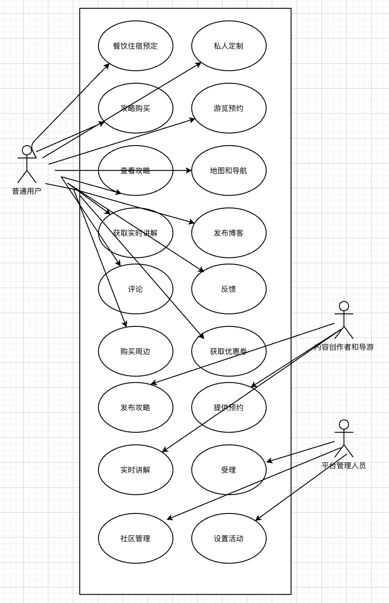

## 3.前景与范围

### 3.1业务需求

 #### 3.1.1 应用背景

随着生产力上升，人们的空余时间逐渐增多，且各地顺应政策趋势均大力发展旅游业，各类景区逐渐成为人们假期的首选去处，而在旅游期间，如何在景区中规划合理的路线是十分重要的，但如今旅游行业的几种解决方式都存在一些缺陷，首先是传统的导游，许多情况下一个导游会带领许多不同的游客，但是大量人们的旅游需求可能各不相同，人们需要更加 多元的旅游选项，即能够在旅游的时候获得适合自己与自己喜欢的旅游体验，单一的导游可能无法提供相关服务，因为导游的分配较为随机，且导游个人精力有限无法顾及不同的游客。有的景区针对这类情况景区会配备电子设备让游客自行浏览景区，但这类设备较为固定，游客无法智能地浏览自己需要浏览的路线。再者是网络上一些旅游攻略，但旅游攻略都是静态叙述，存在着时间推移后景区发生变化等变数，使得其不能很好地适应人们的旅游过程中出现的一些意外因素。所以人们需要一个针对个人定制，并且能够智能、实时提供导游服务的产品。

#### 3.1.2 业务机遇

目前国内还没有一个一站式解决所有旅游需求和提供游客之间相互交流旅游感受和经历的软件，我们的产品上架后能有效地填补这部分市场的空白。

#### 3.1.3 业务目标与成功标准

##### 3.1.3.1 业务目标

| 业务目标ID     | BO-01                                            |
| -------------- | ------------------------------------------------ |
| **内容**       | 提供大多数旅游景点的导游服务                     |
| **度量标**     | 景点至少包括4A星级及以上的景区                   |
| **计量方法**   | 查看在软件在上述景区中的服务情况                 |
| **理想标准**   | 上述景区中软件都能提供相关服务                   |
| **一般标准**   | 只有相对热门景区能提供相关服务                   |
| **最低标准**   | 只有5星级热门景区能提供相关服务                  |
| **业务目标ID** | **BO-02**                                        |
| **内容**       | 软件要能够提供用户能输入旅游路线                 |
| **度量标**     | 用户能够输入旅游路线                             |
| **计量方法**   | 系统自动识别                                     |
| **理想标准**   | 上述度量标准全部完成                             |
| **一般标准**   | 上述度量标准全部完成                             |
| **最低标准**   | 上述度量标准全部完成                             |
| **业务目标ID** | **BO-03**                                        |
| **内容**       | 软件要能够景区内部的地图导航                     |
| **度量标**     | 景区内所有地方均能导航                           |
| **计量方法**   | 导航路线覆盖景区内部地图的范围                   |
| **理想标准**   | BO-01 中的理想标准均能导航                       |
| **一般标准**   | BO-01 中的一般标准均能导航                       |
| **最低标准**   | BO-01 中的最低标准均能导航                       |
| **业务目标ID** | **BO-04**                                        |
| **内容**       | 软件要能够提供景区周边一站式预定餐饮和住宿的功能 |
| **度量标**     | 用户能够在软件中预定餐饮和住宿                   |
| **计量方法**   | 系统自动识别                                     |
| **理想标准**   | BO-01 中的理想标准均能预定                       |
| **一般标准**   | BO-01 中的理想标准均能预定                       |
| **最低标准**   | BO-01 中的理想标准均能预定                       |
| **业务目标ID** | **BO-05**                                        |
| **内容**       | 软件能够为用户提供智能规划和推荐                 |
| **度量标**     | 用户能够在软件浏览软件针对不同用户的推荐和规划   |
| **计量方法**   | 系统自动识别                                     |
| **理想标准**   | 上述度量标准全部完成                             |
| **一般标准**   | 上述度量标准全部完成                             |
| **最低标准**   | 上述度量标准全部完成                             |
|                |                                                  |

#### 3.1.3.2 成功标准

SC-01：在第一版系统应用之后的三个月内，客户数量应该达到万级

SC-02:  在第一版系统应用之后的十二个月内，平台社区发布的博客和帖子应该超过万级

SC-03：在第一版系统应用之后的六个月内，填写调查问卷后采集到的用户满意应该达到80%

SC-04：在第一版系统应用之后的十二个月内，用户使用注册会员数应该达到4000

SC-05：在第一版系统应用之后的六个月内，用户使用导游功能的次数应该达到万次

SC-06：在第一版系统应用之后的六个月内，用户使用预定功能的次数应该超过万次

### 3.1.4 业务风险

| 风险ID | 风险描述                         | 可能性 | 影响 |
| ------ | -------------------------------- | ------ | ---- |
| R1-01  | 得知和使用平台的人太少           | 0.3    | 0.9  |
| R1-02  | 疫情原因导致旅游业停摆           | 0.4    | 1.0  |
| R1-03  | 景区不愿意提供景区相关内容       | 0.3    | 0.5  |
| R1-04  | 在平台消费的用户过少使得无法盈利 | 0.5    | 0.5  |
| R1-05  | 用户认为软件侵犯了隐私           | 0.7    | 0.2  |
|        |                                  |        |      |

## 项目背景

### 3.2.1 前景概述

当今社会人与人之间更加原子化，用户在旅游时更像要与同伴同行或自己独行，不愿意与不相识的人一起，旅游时不同的需求被分散在不同的软件和地点，人们花在其他地方的精力被迫增加，人们需要一个一站式能够解决旅游时各种需求的平台，可是市面上这类平台大多分散且功能不完全

而我们的平台包含了旅游时所需的各类服务，且在最关键的旅游期间能够提供智能导航和路线规划，并且提供了用户友好的社区，方便用户进行交流和推荐。

### 3.2.2 主要特性

FE-1：提供了智能规划路线的功能

FE-2：提供了预定餐饮和住宿的功能

FE-3：提供了景区内导航的功能

FE-4：提供了智能讲解的功能

FE-5：提供了用户交流沟通的社区

FE-6：提供了用户反馈的功能

FE-7：提供了智能推荐的功能

FE-8：提供了用户注册VIP的功能

FE-9：提供了用户发表旅游博客、创作旅游视频的功能

### 3.2.3 假设与依赖

#### 假设

AS-1：用户允许我们访问他们所在的地址

AS-2：用户旅游后会经常在社区发表旅游感想

AS-3：用户会希望能够精细地定制旅游路线

AS-4：用户会在旅游前规划旅游攻略

AS-5：用户会信任他人的旅游推荐和路线推荐

#### 依赖

DE-1：平台要能够获取不同景区内部的不同信息

DE-2：平台要与景区周边餐饮和住宿形成合作

### 3.2.4 用例图

