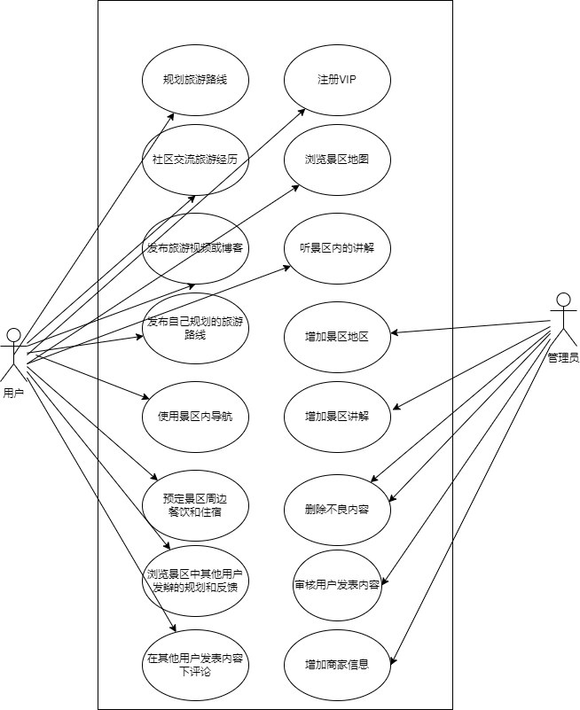
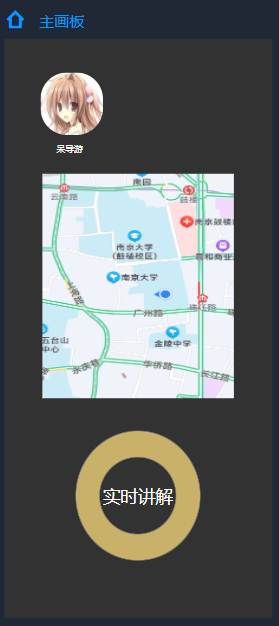
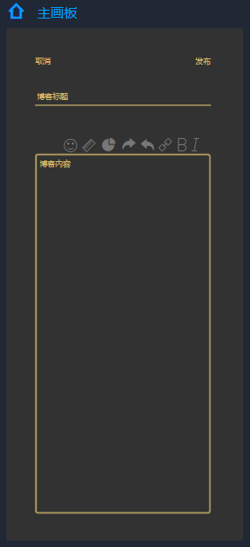
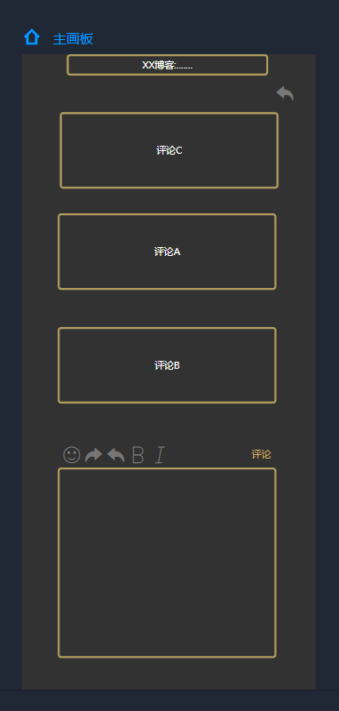
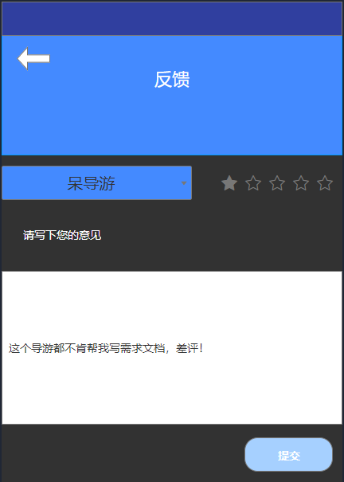
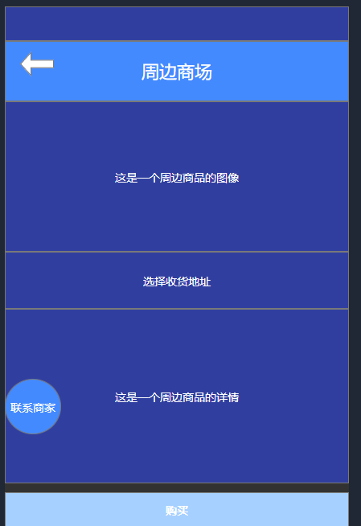
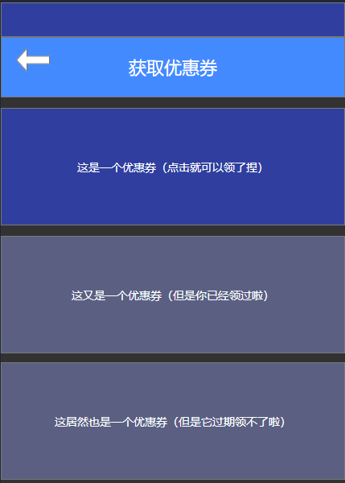

第四次大作业：

## 0 简介：

**0.1 甲方项目名称：**

自游

**0.2 乙方小组成员：**

陈家志 191250009 
陈家伟 191250008 
林均劼 191250084 
张潮越 191250190

**0.3 度量数值：**

##### 0.4 工作概要：

略

**0.5 内容框架：**

## 1 需求获取安排计划书：

## 2 目标模型分析：

> 通过与“甲方”的交流确定项目的若干抽象目标（来自于软件产品 最独特的价值主张、关键业务与 IP 场景集合），并利用课程教授的目标模型进行逐 层分析，要求但不限于完成目标精化、目标冲突与协作、目标实现等内容，每块内 容需要有图形化的模型与相应的文字分析；

### 2.1目标获取：

#### 2.1.1 [achieve] 较多的对旅行攻略付费用户

通过商业模式画布的收入来源与面谈得知，除开如今越来越难获取的广告费，整个APP盈利中轴是对旅行攻略的付费，仅有收费粒度上的区别，长线的会员制和短线的使用费以及2B的佣金收取。因此平台要生存就必须针对愿意付费的用户退出更强大的功能，吸引用户付费。

#### 2.1.2 [maintain] 维护用户的私人化、定制化体验

通过商业模式画布的价值主张、关键业务、客户细分可知，甲方主要是搭建一个以高质量旅行攻略为基础的配套设备构筑的便携、多元、私人化旅行享受为核心吸引力的软件。

#### 2.1.3 [max] 用户流量

通过面谈以及商业模式画布客户关系可知，旅行攻略的单价不会太高，那么就需要足够的用户量来维持收入，同时广告费也对用户流量有相当程度的要求。关于这部分甲方主要试图通过搭建社区的方法来维护用户粘性以及用户流量。

#### 2.1.4 [maintain] 一定的商业合作规模

从面谈以及商业模式画布的关键合作得知，为了提供价值主张中降低游客的旅行成本为商家创造更多价值可知，会需要对用户提供一定的优惠，那么就必须建立和景区以及商家的合作，同时优质的旅行攻略也需要和优质导游的合作

### 2.2 目标抽象：

1. 系统上线后，通过首批高质量旅行攻略以及对应定制化、私人化地图结合服务进行营销，获得首批付费用户
2. 系统上线后的首三个月，通过在导游方进行大力线下推广，用户数量不断增加，用户流量增大
3. 系统上线后的三个月内，通过社区构建和优质导游的引进，维护攻略质量，并完善对应的地图导航功能，进而维持用户的私人化、定制化满意度
4. 系统上线后的一个月内，借助上线初的风潮，增加商业合作机会，与各自媒体、导游建立合作
   系统上线的三个月内，建立与景区和商家的商业合作，三个月后保持一定的商业合作规模。

### 2.3 目标列表：

| 较多的对旅行攻略付费用户 | 维护用户的私人化、定制化体验 | 用户流量       | 一定的商业合作规模 |
| ------------------------ | ---------------------------- | -------------- | ------------------ |
| 旅游路线与地图结合       | 用户画像维护                 | 优秀的社区氛围 | 良好的激励创作机制 |
| 旅行攻略的一站式服务     | 私人化的解说词               | 活跃用户数量   | 提高平台知名度     |
| 审查机制                 |                              |                | 多方面合作         |

### 2.4 目标精化：

#### 2.4.1 [achieve] 较多的对旅行攻略付费用户

##### 2.4.1.1[achieve] 旅游路线与地图结合

[achieve] 一体化的旅游地图

把旅游攻略路线结合到主流地图软件上，便携使用

[achieve] 可交互的多维导航体验

耳机中的解说语音，APP上的相关咨询构筑视听多维体验、同时具体内容可通过用户的语音或用户的地理位置或APP按键进行调整（类可交互视频）

##### 2.4.1.2[maintain]旅行攻略的一站式服务

[maintain] 一定的优惠服务

一站式的过程中，能够自动推荐对应商店的优惠列表，甚至提供一些独家的优惠券

[achieve] 一站式的服务列表

提供集成出行、用餐、旅居、导航、解说为一体的体验

##### 2.4.1.3[achieve] 审查机制

- 提供一些众裁机制，对导游评级的机制

#### 2.4.2 [maintain] 维护用户的私人化、定制化体验

##### 2.4.2.1 [maintain] 用户画像维护

- 通过搜集用户的浏览记录（主要是对旅游路线）、评论行为、消费行为、消费层级维护用户的用户画像，并以此进行合适内容推荐，比如喜好的酒店、饭馆、旅游的地区范围

##### 2.4.2.2 [achieve] 私人化的解说词

- 购买了高档服务的顾客，在使用旅游攻略时可以根据自己的喜好、心情获取不同的景点解说
  - 比如今天想听历史就多讲点历史相关，想听地理就多讲点地理，传闻等等也行

#### 2.4.3 [max] 用户流量

##### 2.4.3.1 [maintain] 优秀的社区氛围

[achieve] 社区管理

提供客服受理服务以及管理员管理的接口

[achieve] 分享机制

游客可以发动态，如旅游日记，同时可以评价某些导游的服务体验

[achieve] 评论交互机制

游客、路人、导游等各各用户都可以参与到动态、评价的互动中，具体包括点赞、点踩、评论等

##### 2.4.3.2 [max]活跃用户数量

[achieve] 等级机制

APP用户在社区的活跃可以反映到等级上，对高等级用户给予消费上的优惠或创作内容的免费推广。

[maintain] 举办活动

通过不定期举办活动激励用户参与社区建设。

#### 2.4.4 [maintain] 一定的商业合作规模

##### 2.4.1[maintain] 良好的激励创作机制

合适的佣金比例，以及优秀作品的佣金减免（类似政府对先进企业的减税保护），可以润滑与优质导游、自媒体用户之间的合作关系

##### 2.4.2 [max] 平台知名度

提高平台知名度能让我们在与景区商家合作的谈判中占据优势地位

##### 2.4.3 [achieve] 多方面合作

###### 2.4.3.1 [achieve] 与旅游相关餐饮、宾馆合作

###### 2.4.3.2 [achieve] 与导游的合作

###### 2.4.3.3 [achieve] 与景区商家的合作

### 2.5 目标冲突与协作

#### 2.5.1 目标冲突

##### 2.5.1.1 用户数量——社区氛围

我们平台必须要有尽可能多的用户才能打造出一个成熟的社区，但是另一方面用户人数的增加会为我们的平台不可避免地带来水军和低素质用户，影响用户评分的真实性和评论环境的和谐性，损害社区氛围

##### 2.5.1.2 用户激励——平台抽成

我们的平台需要为用户提供一定的创作激励机制来增加用户黏度，激发创作意愿，但是稳定性高的佣金抽成是平台收入中一个重要部分，激励机制也会对平台收入带来一定的影响

##### 2.5.1.3 分享机制——攻略购买

不排除用户可能在购买优秀攻略之后发布在平台上，导致优质内容外泄，损害创作者收益，不利于维持平台和创作者之间的良好的合作关系，但是分享机制是用户社区的核心之一，也不可能过于限制用户社区的自由度。另外可能有些用户想要把自己所有的攻略都设置成付费的，与平台的分享理念相悖

#### 2.5.2 目标协作

##### 2.5.2.1 提高平台知名度——展开多方面合作

为了提高平台的知名度，与自媒体，导游和旅游相关单位（如餐饮，宾馆，景点）等合作，拓展平台推广途径，同时也提高平台服务内容多样性和完善性，进而提升平台质量和使用体验，有益于提高平台知名度。

##### 2.5.2.2 创作激励机制——用户流量

创作激励机制能够提高用户的分享意愿，为社区提供更多高质量内容，有利于维持社区良好氛围，优质的社区内容也能为平台带来更多的用户流量

##### 2.5.2.3 用户的私人化、定制化服务——更多的付费攻略购买

用户购买优质（但不是定制化的）攻略内容并获得良好的用户体验之后更可能愿意尝试购买（可能更贵的）私人化和定制化服务，而反之同理，购买前者（私人定制的服务）并获得良好体验的用户在下次出行时就算不购买定制化服务也可能会考虑购买付费的优质攻略

##### 2.5.2.4 一站式服务——展开多方面合作

为了提供一站式服务，地图和酒店餐厅预定等服务都需要和相应的供应方展开合作，同时开展优惠服务也需要和相应资源提供方进行沟通

### 2.6 目标阻碍

#### 2.6.1 用户流量

##### 2.6.1.1 用户过少，社区不成熟，愿意分享的用户少 

##### 2.6.1.2 社区环境不好，劣质内容过多导致用户流失

##### 2.6.1.3 抽成比例不够合理导致创作者关系恶化并流失优质创作者

#### 2.6.2 私人定制服务

##### 2.6.2.1 分析算法不够优秀，使用户画像有所偏差，损害推荐质量

##### 2.6.2.2 内容创作者不够优秀，私人服务满意度不高导致购买意愿降低

##### 2.6.2.3 部分付费优质攻略被公开，用户能免费获取，导致购买意愿下降

#### 2.6.3 一站式服务

##### 2.6.3.1 平台规模小资金不足无法开展某些必要合作

##### 2.6.3.2 平台抽成或优惠活动影响合作方收益，影响合作关系

#### 2.6.4 社区环境

##### 2.6.4.1 用户数量少社区不成熟

##### 2.6.4.2 水军和低素质用户进入并得不到有效监管，影响社区氛围

##### 2.6.4.3  激励机制力度不够，愿意分享的用户少，分享氛围不好

### 2.7 目标实现

#### 2.7.1普通用户：获取一站式的游玩服务

1. 在出行前使用**餐饮住宿预定模块**，预定餐饮和住宿
2. 使用**私人定制**功能，定制私人化游玩路线和攻略
3. 使用**攻略购买**功能，某买其他用户发布的优质付费功能
4. 使用嵌入到地图模块的**查看攻略**功能在地图上查看自己的旅行攻略
5. 在景区游览之前使用**游览预约**功能在平台上预约导游和预定私人化讲解服务
6. 在景区游览时使用**地图和导航**功能实时获取位置，规划路线
7. 使用**解说词**获取当前景点的实时讲解
8. 在游览之后在用户社区使用**发表博客**功能分享相关的游玩体验和经历
9. 在用户社区他人的帖子下方使用**评论**功能发表评论
10. 可以使用**反馈功能**对自己预约过的导游进行评价
11. 平时还能使用**周边商店**，在平台上购买景点周边
12. 点击**“我的优惠券”**模块获得优惠券

#### 2.7.2 内容创作者和导游

1. 使用**发布攻略**功能在社区发表自己创作的旅游攻略
2. 使用**提供预约**功能在社区上寻找愿意接受导游服务的客户
3. 使用**实时讲解**功能为定制服务的客户进行私人讲解服务

#### 2.7.3 平台管理和客服人员

1. 使用**受理**功能对有问题或者想要投诉的客户进行解答和反馈
2. 使用**社区管理**功能对做出损害社区风气（如剽窃，刷评，评论引战）的行为的用户进行一定的惩处
3. 使用**设置活动**功能举办社区活动

## 3.前景与范围：

### 3.1业务需求

 #### 3.1.1 应用背景

随着生产力上升，人们的空余时间逐渐增多，且各地顺应政策趋势均大力发展旅游业，各类景区逐渐成为人们假期的首选去处，而在旅游期间，如何在景区中规划合理的路线是十分重要的，但如今旅游行业的几种解决方式都存在一些缺陷，首先是传统的导游，许多情况下一个导游会带领许多不同的游客，但是大量人们的旅游需求可能各不相同，人们需要更加 多元的旅游选项，即能够在旅游的时候获得适合自己与自己喜欢的旅游体验，单一的导游可能无法提供相关服务，因为导游的分配较为随机，且导游个人精力有限无法顾及不同的游客。有的景区针对这类情况景区会配备电子设备让游客自行浏览景区，但这类设备较为固定，游客无法智能地浏览自己需要浏览的路线。再者是网络上一些旅游攻略，但旅游攻略都是静态叙述，存在着时间推移后景区发生变化等变数，使得其不能很好地适应人们的旅游过程中出现的一些意外因素。所以人们需要一个针对个人定制，并且能够智能、实时提供导游服务的产品。

#### 3.1.2 业务机遇

目前国内还没有一个一站式解决所有旅游需求和提供游客之间相互交流旅游感受和经历的软件，我们的产品上架后能有效地填补这部分市场的空白。

#### 3.1.3 业务目标与成功标准

##### 3.1.3.1 业务目标

| 业务目标ID     | BO-01                                            |
| -------------- | ------------------------------------------------ |
| **内容**       | 提供大多数旅游景点的导游服务                     |
| **度量标**     | 景点至少包括4A星级及以上的景区                   |
| **计量方法**   | 查看在软件在上述景区中的服务情况                 |
| **理想标准**   | 上述景区中软件都能提供相关服务                   |
| **一般标准**   | 只有相对热门景区能提供相关服务                   |
| **最低标准**   | 只有5星级热门景区能提供相关服务                  |
| **业务目标ID** | **BO-02**                                        |
| **内容**       | 软件要能够提供用户能输入旅游路线                 |
| **度量标**     | 用户能够输入旅游路线                             |
| **计量方法**   | 系统自动识别                                     |
| **理想标准**   | 上述度量标准全部完成                             |
| **一般标准**   | 上述度量标准全部完成                             |
| **最低标准**   | 上述度量标准全部完成                             |
| **业务目标ID** | **BO-03**                                        |
| **内容**       | 软件要能够景区内部的地图导航                     |
| **度量标**     | 景区内所有地方均能导航                           |
| **计量方法**   | 导航路线覆盖景区内部地图的范围                   |
| **理想标准**   | BO-01 中的理想标准均能导航                       |
| **一般标准**   | BO-01 中的一般标准均能导航                       |
| **最低标准**   | BO-01 中的最低标准均能导航                       |
| **业务目标ID** | **BO-04**                                        |
| **内容**       | 软件要能够提供景区周边一站式预定餐饮和住宿的功能 |
| **度量标**     | 用户能够在软件中预定餐饮和住宿                   |
| **计量方法**   | 系统自动识别                                     |
| **理想标准**   | BO-01 中的理想标准均能预定                       |
| **一般标准**   | BO-01 中的理想标准均能预定                       |
| **最低标准**   | BO-01 中的理想标准均能预定                       |
| **业务目标ID** | **BO-05**                                        |
| **内容**       | 软件能够为用户提供智能规划和推荐                 |
| **度量标**     | 用户能够在软件浏览软件针对不同用户的推荐和规划   |
| **计量方法**   | 系统自动识别                                     |
| **理想标准**   | 上述度量标准全部完成                             |
| **一般标准**   | 上述度量标准全部完成                             |
| **最低标准**   | 上述度量标准全部完成                             |
|                |                                                  |

#### 3.1.3.2 成功标准

SC-01：在第一版系统应用之后的三个月内，客户数量应该达到万级

SC-02:  在第一版系统应用之后的十二个月内，平台社区发布的博客和帖子应该超过万级

SC-03：在第一版系统应用之后的六个月内，填写调查问卷后采集到的用户满意应该达到80%

SC-04：在第一版系统应用之后的十二个月内，用户使用注册会员数应该达到4000

SC-05：在第一版系统应用之后的六个月内，用户使用导游功能的次数应该达到万次

SC-06：在第一版系统应用之后的六个月内，用户使用预定功能的次数应该超过万次

### 3.1.4 业务风险

| 风险ID | 风险描述                         | 可能性 | 影响 |
| ------ | -------------------------------- | ------ | ---- |
| R1-01  | 得知和使用平台的人太少           | 0.3    | 0.9  |
| R1-02  | 疫情原因导致旅游业停摆           | 0.4    | 1.0  |
| R1-03  | 景区不愿意提供景区相关内容       | 0.3    | 0.5  |
| R1-04  | 在平台消费的用户过少使得无法盈利 | 0.5    | 0.5  |
| R1-05  | 用户认为软件侵犯了隐私           | 0.7    | 0.2  |
|        |                                  |        |      |

### 3.2 项目背景

#### 3.2.1 前景概述

当今社会人与人之间更加原子化，用户在旅游时更像要与同伴同行或自己独行，不愿意与不相识的人一起，旅游时不同的需求被分散在不同的软件和地点，人们花在其他地方的精力被迫增加，人们需要一个一站式能够解决旅游时各种需求的平台，可是市面上这类平台大多分散且功能不完全

而我们的平台包含了旅游时所需的各类服务，且在最关键的旅游期间能够提供智能导航和路线规划，并且提供了用户友好的社区，方便用户进行交流和推荐。

#### 3.2.2 主要特性

FE-1：提供了智能规划路线的功能

FE-2：提供了预定餐饮和住宿的功能

FE-3：提供了景区内导航的功能

FE-4：提供了智能讲解的功能

FE-5：提供了用户交流沟通的社区

FE-6：提供了用户反馈的功能

FE-7：提供了智能推荐的功能

FE-8：提供了用户注册VIP的功能

FE-9：提供了用户发表旅游博客、创作旅游视频的功能

#### 3.2.3 假设与依赖

##### 假设

AS-1：用户允许我们访问他们所在的地址

AS-2：用户旅游后会经常在社区发表旅游感想

AS-3：用户会希望能够精细地定制旅游路线

AS-4：用户会在旅游前规划旅游攻略

AS-5：用户会信任他人的旅游推荐和路线推荐

##### 依赖

DE-1：平台要能够获取不同景区内部的不同信息

DE-2：平台要与景区周边餐饮和住宿形成合作

#### 3.2.4 用例图

### 3.3 项目范围

#### 3.3.1 范围列表

| 特性 ID | 版本一   | 版本二   | 版本三   |
| :------ | :------- | :------- | :------- |
| FE-1    | 部分实现 | 完全实现 | 完善实现 |
| FE-2    | 完全实现 |          |          |
| FE-3    | 完全实现 |          |          |
| FE-4    | 部分实现 | 完全实现 |          |
| FE-5    | 部分实现 | 完全实现 |          |
| FE-6    | 完全实现 |          |          |
| FE-7    | 部分实现 | 完全实现 | 完善实现 |
| FE-8    | 不实现   | 完全实现 |          |
| FE-9    | 完全实现 |          |          |

#### 3.3.2 限制与排除

LT-1:本软件主要的服务范围集中在国内，没有考虑国外的用户及旅游范围。

LT-2:系统维护期间会对平台内的用户交流和内容创作者的内容发布。

LT-3:软件对导游的知识所有权考虑欠缺。

LT-4:软件在用户的自我可定制性方面并没有提供有针对性的解决方案。

### 3.4 项目环境

#### 3.4.1 操作环境

OE-1: 用户可以在任意时间使用该软件

OE-2: 用户可以在任意位置使用该软件

OE-3: 用户的使用数据包括时间位置使用情况都会被记录并且用于算法推荐

OE-4: 用户在服务器离线时，可以使用本地已缓存数据进行浏览

OE-5: 除支付功能外，服务器离线可以忍受的

OE-6: 用户的所有使用数据会被严格限制使用范围，仅用于平台的算法分析，并被严格保护

OE-7: 在进行支付时，如果使用的是第三方平台，支付安全应由第三方支付平台保障

#### 3.4.2 涉众

| 涉众       | 主要目标                               | 态度                               | 主要关注点                       | 约束条件             |
| :--------- | :------------------------------------- | :--------------------------------- | :------------------------------- | :------------------- |
| 普通游客   | 定制个人旅游计划，想要深入了解景点     | 愿意使用                           | 景点讲解优质，有特色             | 需要注册登录         |
| 会员游客   | 全面的个性化定制体验，广泛获取旅游攻略 | 非常愿意使用                       | 个性化的定制服务，海量旅游资源   | 需要付费购买会员     |
| 内容创作者 | 发布自己独特的旅游见解获得收益         | 在可以获取一定收入的情况下愿意使用 | 平台带来的丰富用户资源           | 需要注册登录发布作品 |
| 景区或商家 | 提高自身知名度达到广告效果             | 愿意使用                           | 平台带来的丰富用户资源和传播渠道 | 需要积极推送自身形象 |

#### 3.4.3 项目属性

| 属性 | 执行者                                                       | 约束因素                                                     | 可调整因素                                                   |
| :--- | :----------------------------------------------------------- | :----------------------------------------------------------- | :----------------------------------------------------------- |
| 进度 |                                                              |                                                              | 一个月内完成第一版的软件开发，之后尽量保证每一个月都进行产品的迭代升级，最多延期半个月。 |
| 特性 |                                                              | 每一个版本中要求实现的特性必须全部实现                       |                                                              |
| 质量 |                                                              | 产品必须通过所有验收测试，必须通过全部安全测试，所有安全事务都必须遵循安全标准。 |                                                              |
| 人员 | 团队规模包括一名项目经理、五名开发人员、三名测试人员，还可以视情况增加兼职的美工等人员 |                                                              |                                                              |
| 成本 |                                                              |                                                              | 尽量严格控制项目费用不超过预算，如确实无法保证，最多可超出预算 30% |

## 4 面谈报告与原型物件：

#### 4.1.2 第二次面谈

#### 4.1.2.2 面谈时间

2021年12月22日17：00

#### 4.1.2.2 面谈地点

广州路门麦当劳

#### 4.1.2.3 面谈参与人员

甲方：蔡文俊，樊言鹏，俞正琦

乙方：陈家伟，陈家志，林均劼，张潮越

#### 4.1.2.4 面谈内容

1. 是否允许用户自己创建旅游路线？

   允许

2. 导游需要展示自己的哪些信息？

   诸如工作经验、旅游路线和用户评价这类信息

3. 用户评价具体如何获取？

   每个用户在旅游完成后都可以对导游进行评分和反馈，其他用户可以看

4. 客户与导游之间产生纠纷平台如何处理？

   客户可以与平台专门人们进行投诉或者举报，由专门人员受理事件

5. 如何保持社区的优质？

   鼓励用户发表自己的旅游经历，并且限制社区内的不良内容

6. 如何保障顾客的隐私安全？

   将服务器的安全系统完善，平台自觉遵守相关条例

7. 如何保证餐饮和住宿商家愿意加入平台？

   初期给予他们部分抽成，后期保证用户流量，商家自然就会入住

8. 如何获得景区内的精确导航？

   根据景区地图进行绘制，并雇佣人员进行实地调查

9. 景点周边的货源如何获取？

   与景区商家购买，或者建立合作关系

10. 如何保证用户流量？

    以导航为主要吸引力，在通过社区等功能留住用户

#### 4.1.2.5 面谈摘要

| 会见者：陈家伟，陈家志，林均劼，张潮越 |
| -------------------------------------- |
| 被会见者：蔡文俊，樊言鹏，俞正琦       |
| 面谈日期：2021年12月22日               |
| 面谈内容：就产品详细需求与甲方达成一致 |
|                                        |

#### 4.1.4 第四次面谈

#### 4.1.4.1 面谈时间

2021年12月27日17：00

#### 4.1.4.2 面谈地点

广州路门麦当劳

#### 4.1.4.3 面谈参与人员

甲方：蔡文俊，樊言鹏，俞正琦

乙方：陈家伟，陈家志，林均劼，张潮越

#### 4.1.4.4 面谈内容

1. 用户画像构建要搜集社区互动（点赞、点踩）信息吗？
   要

2. 社区是否支持回复某条评论
   支持

3. 哪些功能是可以设置开启的？如、导游推荐等
   跟商业相关的部分（广告）不能关闭，别的部分可以有简洁版选项

4. 定制功能对所有用户开放吗？还是只对付费用户
   只对付费用户

5. 运营可以手动推荐博客吗？

   可以

6. 博客需要可以设置关闭评论区吗？
   需要

7. 博客和评论需要有敏感词检查吗？
   需要，不然容易出舆论问题

8. 实时讲解的同时要不要提供实时定位？
   需要，能让游客和导游都更好的把握内容的受发

9. 对于用例，你们还有什么意见和建议吗？
   没有特别大的意见，就是用例粒度可以的话可以细化一下

10. 对于文档，你们还有什么意见和建议吗？
    有几处用词不够精确，可能造成歧义

11. 对于原型，你们还有什么意见和建议吗？
    可以做的风格更统一一点

#### 4.1.4.5 面谈摘要

| 会见者：陈家伟，陈家志，林均劼，张潮越 |
| :------------------------------------- |
| 被会见者：蔡文俊，樊言鹏，俞正琦       |
| 面谈日期：2021年12月27日               |
| 面谈内容：与甲方敲定文档和原型         |

### 4.2 原型物件

原型工具：摹客

#### 4.2.7：实时讲解页面

#### 4.2.8 发布博客页面：

#### 4.2.9 评论页面

#### 4.2.10 反馈

#### 4.2.11 周边购买

#### 4.2.12 获取优惠券

## 5 用户需求文档：

### 5.1 引言

#### 5.1.1 目的

本文档描述了自游软件的用例文档。

#### 5.1.2 背景

本软件致力于给大众打造一款自由可定制化的旅游导航助手，出发点是让手机成为人们的私人导游，用便捷的、私人化的、多元的服务为用户创造值得珍藏的旅行时光，主要针对真正热爱旅游，热爱景点背后的文化内涵的游客，自游平台的亮点在于打破了旅客和导游之间界限，使得旅客可以自由选择特定导游提供的旅游路线。

### 5.2 用户需求文档

#### 5.2.1 业务需求

- BR1：**攻略制定功能**软件能够让用户在游览前进行攻略制定
  - 用户能够在平台上浏览攻略并购买或参照免费攻略，点击“制定攻略”按钮，制定游玩攻略并添加到行程中
  - 攻略可以嵌入在地图上，所以在地图中也能点击按钮获取攻略，此时攻略路线会显示在地图上，并显示攻略内容的标签（标签有字数限制，过长会影响地图的正常使用），不过具体文字不会显示在地图上，需要点击”具体攻略“按钮才可获取。
- BR2：**预约功能：**软件能够让用户进行游览前的预约
  - 用户能在平台上预约酒店和餐厅，同时也能预约导游
  - 用户也可以在平台上找攻略提供方制定**私人定制**的游览方案，预约中选择私人定制后会有相应的支付环节
  - 如果临时有事情预约模块提供取消功能，但是私人定制的游览方案无法退款

- BR3：**社区功能：**软件能让用户在用户社区上发表自己的游览体验以及为他人发布攻略

  - 用户能在社区发表自己的游览精力和对导游的评价
  - 用户能自己设计游览攻略并发布在社区中
  - 游览攻略设计时下方会显示一个小地图，创建者需要将自己的攻略中的地点填入地图中，以便之后用户在地图上获取
  - 用户能在社区中对于他人的博客和评论发表自己的评论
  - 发布博客选择“创建博客”编辑内容，之后选择发布就可，发表评论则点击他人的博客或评论下方的评论按钮，输入内容并发布就可

- BR4：**讲解和地图功能：**软件能让用户在游览时查看地图并实时获取景点讲解

  - 用户能在地图上看到自己当前位置
  - 用户在景点附近时能够通过地图上的讲解获取功能获取实时讲解（包括私人定制内容）
  - 由于用户的私人定制讲解可以根据个人喜好调整，所以如果要切换讲解词需要在获取讲解词时选取类型（如民俗优先，历史优先，志怪优先等类型），中间没有再次选择类型则不再改变类型，如需切换需要退出并选择类型

- BR5：**商城功能：**软件能够让用户购买景区的纪念品

  - 用户在商城中选择推荐页面的纪念品购买（推荐页面参考用户画像生成），或者直接搜索地名或景区选择搜索结果中的商品购买
  - 购买后一定时间内（7天内）可以点击退货功能退货，也可以在商品评论区评价，如果要投诉需要到反馈模块进行投诉

- BR6：**反馈功能：**软件能回复和处理用户投诉

  - 系统给客服人员分配用户投诉，客服人员根据自己收到的用户投诉进行受理，并需要将受理结果通过反馈模块的聊天框告知用户
  - 如果时社区相关的投诉和举报，需要将业务转交给社区管理员

- BR7：**社区管理：**软件具有社区管理员进行管理

  - 系统会将社区内容相关的投诉，举报（如剽窃，刷评论和评论引战等违反社区管理公约的行为）和反馈分配给社区管理员，由社区管理员处理，处理结果通过客服回复给用户

  - 社区管理员可以点击举办活动按钮，举办社区活动（如送积分，送奖券），并点击发布按钮发布在社区中

    

#### 5.2.2 用户需求

- UR1：提供餐饮住宿预定功能
- UR2：提供游览预约功能，让用户可以预约浏览，导游可以在社区上寻找愿意接受导游服务的客户
- UR3：提供社区功能，让不同用户可以在社区中进行博客发布、对他人博客的评论
- UR4：提供反馈功能，让用户对自己预约过的导游/攻略进行评价
- UR5：提供攻略服务功能，让用户可以查看攻略并进行攻略的购买，让导游可以在社区发表自己创作的旅游攻略
- UR6：提供私人定制功能，让用户可以定制私人化游玩路线和攻略
- UR7：提供地图和导航功能，让用户可以在景区游览时实时获取位置，规划路线
- UR8：提供实时讲解功能，让用户可以获取当前景点的实时讲解，让导游能为定制服务的客户进行私人实时讲解服务
- UR9：提供周边购买功能，让用户可以在平台上购买景点周边，并可以获取合适的优惠券
- UR10：提供受理功能，让客服能对有问题或者想要投诉的客户进行解答和反馈
- UR11：提供社区管理功能，让管理员能对做出损害社区风气（如剽窃，刷评，评论引战）的行为的用户进行一定的惩处
- UR12：提供活动功能，让管理员能举办社区活动，用户能参与活动

### 5.3用例列表

#### 5.3.1 用例图

#### 5.3.2 用例列表

| 用例编号 | 参与者             | 用例名称     | 优先级 |
| -------- | ------------------ | ------------ | ------ |
| 1        | 普通用户           | 餐饮住宿预定 | 高     |
| 2        | 普通用户           | 私人定制     | 高     |
| 3        | 普通用户           | 攻略购买     | 高     |
| 4        | 普通用户           | 查看攻略     | 高     |
| 5        | 普通用户           | 游览预约     | 中     |
| 6        | 普通用户           | 地图和导航   | 高     |
| 7        | 普通用户           | 获取实时讲解 | 高     |
| 8        | 普通用户           | 发布博客     | 中     |
| 9        | 普通用户           | 评论         | 低     |
| 10       | 普通用户           | 反馈         | 中     |
| 11       | 普通用户           | 购买周边     | 低     |
| 12       | 普通用户           | 获取优惠券   | 中     |
| 13       | 内容创作者和导游   | 发布攻略     | 高     |
| 14       | 内容创作者和导游   | 提供预约     | 中     |
| 15       | 内容创作者和导游   | 实时讲解     | 高     |
| 16       | 平台管理和客服人员 | 受理         | 高     |
| 17       | 平台管理和客服人员 | 社区管理     | 高     |
| 18       | 平台管理和客服人员 | 设置活动     | 中     |
|          |                    |              |        |

### 5.4 详细用例描述

#### 5.4.1

ID：UC1

名称：预定餐饮和住宿

创建者：张潮越

创建时间：2021/12/21

最后一次更新者：张潮越

最后一次更新时间：2021/12/21

参与者：普通用户

触发条件：用户想要预定餐饮和住宿

前置条件：用户进入餐饮住宿预定模块

后置条件：无

优先级：高

正常流程：

1.用户进入餐饮住宿预定模块

2.用户选择想要预定的商家

3.用户提交申请

4.预约成功

拓展流程：

1. 预定已满或者商家暂时不提供服务
   1. 提醒用户具体情况
   2. 重新预定

特殊需求：无

#### 5.4.2

ID：UC2

名称：定制私人化路线和攻略

创建者：张潮越

创建时间：2021/12/21

最后一次更新者：张潮越

最后一次更新时间：2021/12/21

参与者：普通用户

触发条件：用户想要定制私人化游玩路线和攻略

前置条件：用户进入私人定制功能

后置条件：无

优先级：高

正常流程：

1.用户进入私人定制功能

2.用户发出私人定制请求

3.请求受理，私人定制成功

拓展流程：

1. 预定已满或暂时不提供服务
   1. 提醒用户具体情况
   2. 重新选择定制方案

特殊需求：无

#### 5.4.3

ID：UC3

名称：攻略购买

创建者：张潮越

创建时间：2021/12/21

最后一次更新者：张潮越

最后一次更新时间：2021/12/21

参与者：普通用户

触发条件：用户想要购买其他用户发布的优质攻略

前置条件：用户进入攻略购买功能

后置条件：无

优先级：高

正常流程：

1.用户进入攻略购买功能

2.用户选择想购买的攻略

3.支付成功

拓展流程：

1. 支付失败
   1. 提醒用户具体情况
   2. 重新支付

特殊需求：无

#### 5.4.4

ID：UC4

名称：查看攻略

创建者：林均劼

创建时间：2021/12/21

最后一次更新者：林均劼

最后一次更新时间：2021/12/21

参与者：普通用户

触发条件：用户点击地图上的或主页顶栏的攻略获取按钮

前置条件：用户进入地图或主页

后置条件：无

优先级：高

正常流程：

1. 用户进入“所有攻略”页面
2. 用户点击想要查看的攻略，系统显示

拓展流程：

1. 返回列表
   1. 用户点击返回按钮跳转回“所有攻略“页面
   
2. 删除攻略
   
   1. 用户在攻略列表点击删除按钮
   2. 用户依次点击想要删除的攻略
   3. 用户点击确认删除
   
2. 编辑攻略
   
   1. 用户在攻略详情页点击”编辑攻略按钮“
   
   2. 用户输入修改内容
   
   3. 用户点击保存按钮保存修改
   

特殊需求：无

#### 5.4.5

ID：UC5

名称：游览预约

创建者：林均劼

创建时间：2021/12/21

最后一次更新者：林均劼

最后一次更新时间：2021/12/21

参与者：普通用户

触发条件：用户点击主页上的”游览预约“按钮

前置条件：用户登录并进入主页

后置条件：系统为用户添加预约的导游或解说

优先级：中

正常流程：

1. 用户进入预约页面并在搜索栏输入目的地
2. 系统显示地点所有景点，用户点击想要预约的景点
3. 用户点击预约导游按钮，系统显示可选导游
4. 用户点击导游并确认选择，系统跳出对话框
5. 在和导游讨论确认后系统显示导游提交的价格，用户在对话框中点击付款连接，系统跳转至付款页面
6. 用户付款，系统显示预约成功

拓展流程：

1. 预约解说词
   1. 用户在景点页面选择”预约解说词“，系统为用户加载可选类型
   2. 用户点击类型并确认，系统为用户设置好预定解说词
2. 查看预约
   1. 用户在预约页面点击”我的预约按钮“，系统显示所有预约
   2. 用户点击想查看的预约，系统显示预约详情
3. 取消预约
   1. 用户在”预约详情“界面点击”取消预约“按钮
   2. 如果离预约时间在规定期限之内系统为用户跳出”确认取消“按钮，用户点击确认，系统取消预约

特殊需求：无

#### 5.4.6

ID：UC6

名称：地图和导航

创建者：林均劼

创建时间：2021/12/21

最后一次更新者：林均劼

最后一次更新时间：2021/12/21

参与者：普通用户

触发条件：用户主页的地图按钮

前置条件：用户进入主页

后置条件：无

优先级：高

正常流程：

1. 用户进入地图页面并点击导航按钮
2. 用户输入目的地点击确认，系统显示导航信息

拓展流程：

1. 返回地图
   1. 用户点击返回按钮跳转回地图页面
2. 没有合适的路径
   1. 系统提示用户不存在合适，用户点击确认，返回导航界面

特殊需求：系统应能够获取用户当前地理位置

#### 5.4.7 用例7 获取实时讲解

ID：UC7

名称：获取实时讲解

创建者：陈家志

创建时间：2021/12/21

最后一次更新者：陈家志

最后一次更新时间：2021/12/21

参与者：普通用户

触发条件：用户想要获取实时讲解

前置条件：用户已经预约过导游；用户已经进行了私人定制；用户已经到达景点

后置条件：无

优先级：高

正常流程：

1.用户进入与已预约导游的交互界面

2.用户申请实时讲解

3.系统传输导游的实时讲解

拓展流程：

1. 网络错误，传输异常
   1. 提醒用户网络异常
   2. 尝试自动重连

特殊需求：无

#### 5.4.8 用例8 发布博客

ID：UC8

名称：发布博客

创建者：陈家志

创建时间：2021/12/21

最后一次更新者：陈家志

最后一次更新时间：2021/12/21

参与者：普通用户

触发条件：用户想要发布博客

前置条件：用户已经登录社区

后置条件：无

优先级：中

正常流程：

1.用户进入博客页面

2.用户进行博客内容的输入

3.用户提交发布申请

4.系统审核后将博客内容发布

拓展流程：

1. 用户提交内容为空
   1. 提醒用户输入，并拒绝本次上传
2. 用户文章内容审核不通过
   1. 反馈审核失败原因，提醒用户更改
3. 网络错误，传输异常
   1. 提醒用户发布失败，并建议用户自行备份博客内容

特殊需求：无

#### 5.4.9 用例9 评论

ID：UC9

名称：评论

创建者：陈家志

创建时间：2021/12/21

最后一次更新者：陈家志

最后一次更新时间：2021/12/21

参与者：普通用户

触发条件：用户想要对博客进行评论

前置条件：用户已经登录社区；博客所有者未关闭评论区

后置条件：无

优先级：低

正常流程：

1. 用户进入某条博客

2. 用户进入评论界面
3. 用户编辑评论内容
4. 系统将评论内容上传

拓展流程：

1. 用户提交内容为空
   1. 提醒用户输入，并拒绝本次上传
2. 用户提交内容包含敏感词汇
   1. 提醒用户进行更改，并拒绝本次上传
3. 网络错误，传输异常
   1. 提醒用户评论失败，并建议用户检查网络原因

特殊需求：无

#### 5.4.10 用例10 反馈

ID：UC10

名称：反馈

创建者：陈家伟

创建时间：2021/12/20

最后一次更新者：陈家伟

最后一次更新时间：2021/12/20

参与者：普通用户

触发条件：用户想要反馈对导游的评价

前置条件：用户已经预约过导游并完成游览

后置条件：无

优先级：中

正常流程：

1.用户进入反馈页面

2.用户选择要评价的导游

3.用户选择评价内容

4.系统将评价内容上传

拓展流程：

1.评价内容为空

​	1.提醒用户输入

2.已经评价过该导游

​	1.提醒用户不能重复评价

3.用户想要修改评价

​	1.系统显示之前的评价，提示用户是否确定修改

​	2.用户确认修改

​	3.用户修改评价

​	4.系统显示修改成功

特殊需求：无

#### 5.4.11 用例11 购买周边

ID：UC11

名称：购买周边

创建者：陈家伟

创建时间：2021/12/20

最后一次更新者：陈家伟

最后一次更新时间：2021/12/20

参与者：普通用户

触发条件：用户想要购买平台周边

前置条件：用户已登录平台

后置条件：无

优先级：低

正常流程：

1.用户进入周边商场

2.用户选择想要购买的周边

3.用户填写收货信息

4.用户进行付款

5.系统提示付款成功，并提示商家

拓展流程：

1.周边数量为零

​	1.提醒用户已经售罄

2.付款失败

​	1.提醒用户付款失败

​	2.返回购买界面

3.用户想要修改收货信息

​	1.系统显示之前的收货信息，提示用户是否确定修改

​	2.用户确认修改

​	3.用户修改收货信息

​	4.系统显示修改成功

特殊需求：无

#### 5.4.12 用例12获取优惠券

ID：UC12

名称：获取优惠券

创建者：陈家伟

创建时间：2021/12/20

最后一次更新者：陈家伟

最后一次更新时间：2021/12/20

参与者：普通用户

触发条件：用户想要获取优惠券

前置条件：用户已登录平台

后置条件：无

优先级：中

正常流程：

1.用户进入优惠券界面

2.用户领取优惠券

3.系统显示领取成功

拓展流程：

1.优惠券已发放完

​	1.提醒用户优惠券已发放完

2.用户已经领过优惠券

​	1.提醒用户不能重复领取

3.网络中断

​	1.提醒用户由于网络原因领取失败

特殊需求：无

