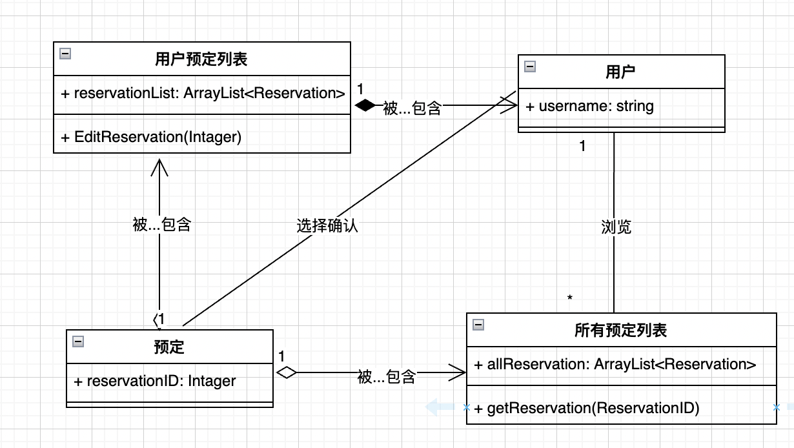
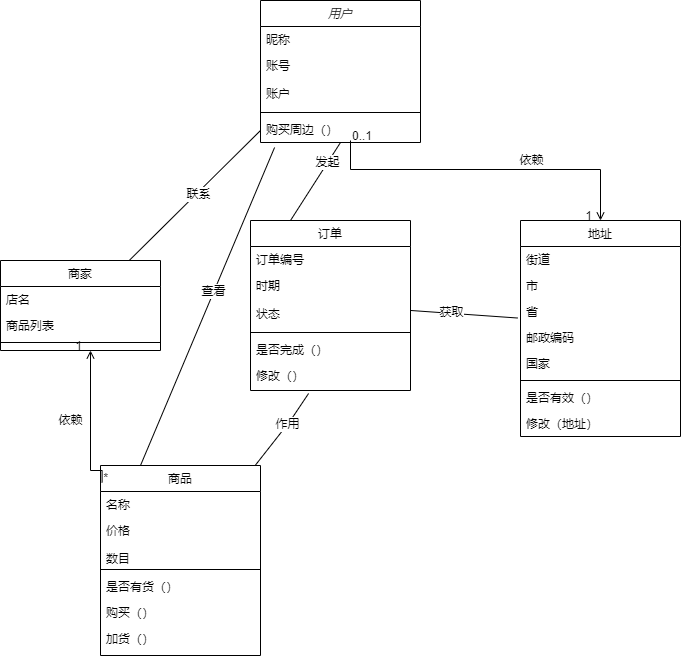
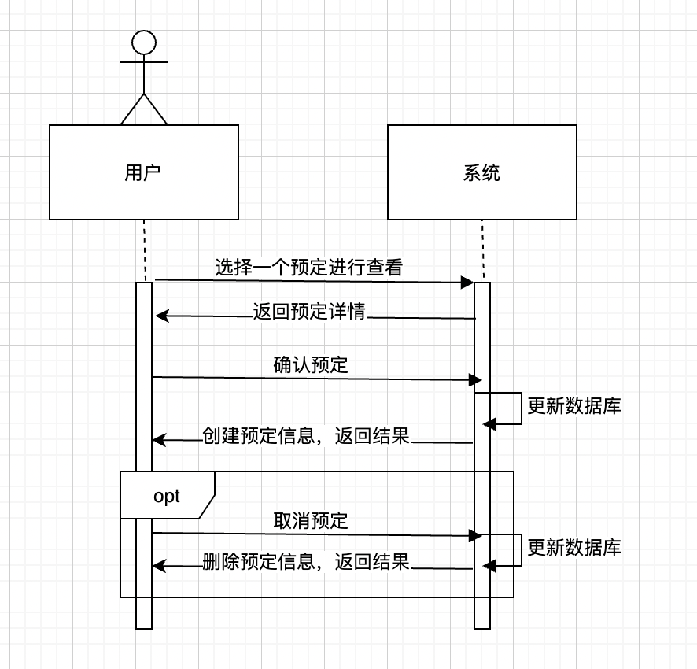
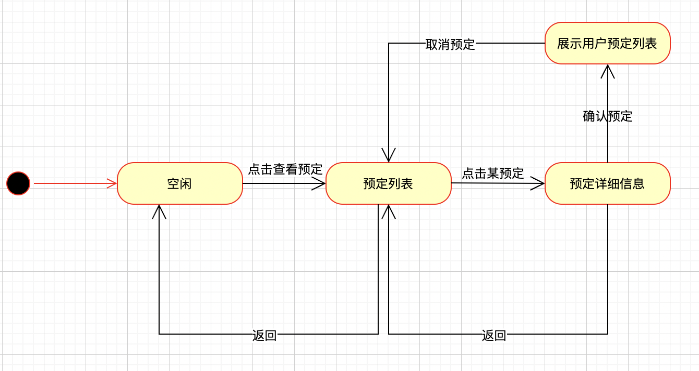
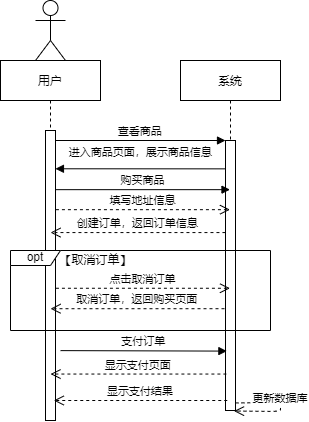
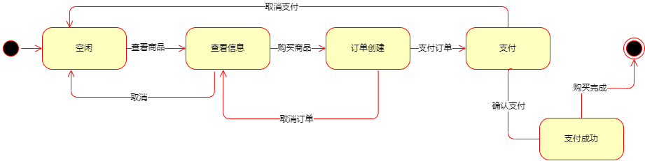

# 简介：

度量数值：每个图都是三段论

小组成员

陈家志 191250009 
陈家伟 191250008 
林均劼 191250084 
张潮越 191250190

工作概要：略

工作框架：分析模型+需求规格说明文档

# 分析模型

## 1.1 概念类图

### 1.1.1 餐饮住宿预定的概念类图

**图给出的目的：**

用于辨识餐饮住宿预定中涉及的对象及这些对象之间关系

**图的介绍以及注意点：**

用户可以浏览所有的预定列表，选择想要预定的目标，添加到自己的预定列表之中。

### 1.1.4 用户查看攻略的概念类图

**图的介绍以及注意点：**用户可以在地图或主页顶栏查看自己的攻略并修改

### 1.1.9 用户评论博客的概念类图

**图给出的目的：**

用于辨识评论用例中的对象及这些对象之间关系

**图的介绍以及注意点：**

用户可以浏览博客，编辑评论，评论依赖敏感词列表检查有效性，可以上传系统。

### 1.1.11 用户购买周边需求的概念类图

**图给出的目的：**

用于购买周边用例中的对象及这些对象之间关系

**图的介绍以及注意点：**

用户可以查看商品信息，可以发起订单，订单可以获取用户地址信息，并且作用于商品，用户也可以与商家联系

## 1.2 详细用例的顺序图和状态图

### 1.2.1 餐饮住宿预定

**顺序图**：

图给出的目的：

展示在餐饮住宿预定中用户和系统的交互序列

用户在预定列表中选择一个详细预定进行查看，系统返回此预定的详细信息，用户可以确认预定，系统更新数据库并返回结果，用户还可以在预定成功后取消，系统更新数据库后返回结果。

**状态图：**

图给出的目的：

从状态转移的角度展示在餐饮住宿预定中的用户行为和系统状态变化

**图的介绍以及注意点：**

用户发出查看请求，系统进入展示餐饮和住宿预定列表，用户点击某一预定，系统进入到详情页展示，用户可确认预定，系统进入展示用户自己的预定列表，若用户取消预定，系统重新返回预定列表。

### 1.2.4 查看攻略

**图给出的目的：**

展示在攻略查看用例中用户和系统的交互序列

**图的介绍以及注意点：**

用户需要登录账号，进入自己的评论列表，可以在评论列表点击删除按钮，选中想要删除的攻略并确认删除，之后可以选取攻略并查看，如果需要修改，点击修改按钮，编辑文字并提交修改，由系统进行内容变更

**图给出的目的：**

从状态转移的角度展示用户行为和系统状态变化

**图的介绍以及注意点：**

用户登陆后点击查看攻略进入自己的攻略列表，点击删除攻略按钮后依次点击想要删除的攻略，并点击确认删除，系统返回删除成功或失败信息；点击具体攻略后系统显示攻略详情页，用户在这个页面可以选择编辑攻略，输入并提交更改后系统更新数据，如果更新成功就返回内容页，如果失败返回更改页，防止用户输入数据丢失，在详情页进行完操作之后点击返回按钮回到攻略列表

### 1.2.9 评论

**图给出的目的：**

用于辨析评论用例中，外部参与者与系统的交互

**图的介绍以及注意点：**

用户可以对特定博客查看是否开放评论区，系统返回结果，用户选择对博客进行评论，编辑评论内容后进行上传。评论进行判空处理后上传系统检测敏感词，如果包含敏感词，那么返回失败信息，否则系统对评论内容进行保存，并返回成功信息。最终无论返回信息如何，由评论对象返回用户评论的结果。

---

**图给出的目的：**

从状态转移的角度完整表达系统在评论用例中的所有行为

**图的介绍以及注意点：**

首先是空闲状态，获取评论区成功则进入评论编辑状态，取消编辑则返回空闲状态，上传并判空失败则进入敏感性检测状态，结果为敏感则返回评论编辑状态，不敏感则进入上传状态，上传失败返回评论编辑状态，上传成功返回空闲状态。

### 1.2.11 购买周边

图给出的目的：

展示在购买周边中用户和系统的交互序列

**图的介绍以及注意点：**

用户可以查看商品，系统返回商品信息，用户选择购买商品，并填写地址信息，系统创建订单并返回订单信息，如果用户取消订单，则返回购买也页面，如继续支付则系统返回支付结果并更新商品的数据库

**图给出的目的：**

从状态转移的角度完整表达系统在购买周边用例中的所有行为

**图的介绍以及注意点：**

首先是空闲状态，点击查看商品进入查看信息状态，取消则返回空闲状态看，点击购买商品进入订单创建状态，点击取消订单则返回查看状态，点击支付订单进入支付状态，取消支付则返回空闲状态，支付成功则完成后退出

# 软件需求规格说明

## 2.1 引言

本文档描述了自游的功能需求和非功能需求。开发小组的软件系统实现与验证工作以此文档为依据。

### 2.1.1 目的

提供一个多终端互联的平台，与绝大多数景区相互关联，定制化旅游路线和旅游讲解，提供景区内导航系统和周边的线上购买功能，还提供了一个用户友好的社区，并且集成了其他出行软件中绝大多数功能，方便用户预定旅游期间的餐饮和住宿，以便利游客旅游时的使用和之后的交流。

### 2.1.2 范围

我们的软件可以做到多景点覆盖，并且提供给用户一个定制化旅游路线的功能、预定餐饮和住宿的功能和一个讨论的的社区，并且允许用户分享自己的定制和旅游经历。最后景区还可以使用我们的软件进行导游的预定和导游服务的定制。

### 2.1.3 参考文献

骆斌、丁⼆⽟，《需求⼯程——软件建模与分析》，北京：⾼等教育出版社，2009.

## 2.2 详细需求描述

### 2.2.1 对外接口描述

#### 2.2.1.1 用户界面

- UI9  用户评论界面：评论应该采用流式预览
  - UI9.1 用户选择编辑评论，系统提供一个Word编辑风格的文本编辑器
    - UI9.1.1 用户选择上传评论
      - UI9.1.1.1 评论审核成功，显示成功结果，系统返回U1 9
      - UI9.1.1.2 评论审核失败，显示失败结果，系统返回U1 9.1
    - UI9.1.2 用户放弃评论，系统返回UI 9 
- UI4 用户查看攻略页面：系统应采用表格风格页面，方便用户浏览攻略列表

  - UI4.1 用户点击返回提示回到攻略列表

  - UI4.2 用户点击查看攻略后的攻略详情页面

    - UI4.2.1 用户点击返回提示回到攻略详情页面

    - UI4.2.2用户点击编辑进入的编辑页面
      - UI4.2.2.1 用户点击确认修改后修改成功
      - UI4.2.2.2 用户点击确认修改后修改失败

* UI11 用户购买周边页面：系统应该使用瀑布流风格页面，帮助用户浏览想要购买的商品

  * UI11.1 用户选择查看商品，系统显示一个商品信息页面

    * UI11.1.1 用户选择购买商品，系统显示一个订单信息
      * UI11.1.1.1 用户选择取消订单，返回11.1
      * UI11.1.1.2 用户选择支付订单，显示支付结果，之后返回UI11.1
* UI11.1.2 用户退出查看商品，系统返回11

#### 2.2.1.2 硬件接口

基于项⽬的状况，无具体硬件接口需求。项目上线选用的都是最新的硬件设备。

#### 2.2.1.3 软件接⼝

- SI1：后端采用 Spring 框架开发，采用maven进行依赖管理 
- SI2：前端使用 Vue3 框架开发，用npm进行包管理

#### 2.2.1.4 通信接口

- CI1：APP使用AJAX请求，与服务器通过HTTPS方式进行通信

### 2.3.2 功能描述

#### 2.3.2.9 评论

##### 2.3.2.9.1 刺激/响应序列

刺激：用户点击评论按钮

响应：系统显示编辑评论界面

刺激：用户点击上传

响应：系统显示确认信息

刺激：用户确认

响应：系统尝试上传评论，返回上传结果

刺激：用户评论内容包含敏感词

响应：系统提示用户修改内容，包含敏感词

##### 2.3.2.9.2 相关功能需求

| Comment.Create       | 系统创建评论临时对象                     |
| -------------------- | ---------------------------------------- |
| Comment.CheckContent | 系统检测评论内容                         |
| Comment.Success      | 系统返回成功信息，并将评论保存到数据库中 |
| Comment.Failed       | 系统返回错误信息                         |

#### 2.3.2.11 购买周边

##### 2.3.2.11.1 刺激/相应序列

刺激：用户点击周边商品按钮

响应：系统显示商品详细信息

刺激：用户点击商品购买按钮

响应：系统弹出订单信息

刺激：用户点击支付订单按钮

响应：系统收到金额后显示购买成功

刺激：用户付款方式支付失败

响应：系统提示支付失败

##### 2.3.2.11.2 相关功能需求

| Commodity.Show                     | 系统返回商品详细信息                       |

    * UI11.1.2 用户退出查看商品，系统返回11

#### 2.3.2 功能描述

**2.3.2.4 查看攻略**

**2.3.2.4.1 刺激/相应序列**

**刺激：用户点击我的攻略按钮**

**响应：系统显示用户目前所有的攻略**

**刺激：用户点击某个用例**

**响应：系统显示具体用例**

**刺激：用户点击编辑按钮**

**响应：系统显示用例编辑页面**

**刺激：用户输入修改文本**

**响应：系统显示修改后文本**

**刺激：用户在地图上调整旅行节点**

**响应：系统显示调整后节点分布**

**刺激：用户点击确认保存**

**响应：系统显示保存成功信息**

**刺激：用户在编辑界面点击退出按钮**

**响应：系统显示详细攻略信息**

**刺激：用户在详细攻略界面点击退出**

**响应：系统显示用户攻略列表界面**

**2.3.2.4.2 相关功能需求**

| **User.showStrategyList**                         | **系统返回用户所有攻略的列表**                         |
| ------------------------------------------------- | ------------------------------------------------------ |
| **StrategyList.showStrategy(ID)**                 | **系统返回指定ID对应的攻略**                           |
| **StrategyList.delete(ID)**                       | **系统根据攻略ID在数据库中删除对饮攻略**               |
| **Strategy.enterModify()**                        | **系统将当前攻略状态设置为修改中，并返回修改页面**     |
| **Strategy.ModifyText(String content,TextBox t)** | **系统将对应文本框中内容变更为输入内容**               |
| **Strategy.ModifyMap(Operation o,Widget w)**      | **系统根据用户对空间的动作修改地图上的行程节点**       |
| **Modify.error()**                                | **修改错误时系统返回编辑页面并提示用户发生了修改错误** |
| **Modify.success()**                              | **修改成功后系统返回攻略详情页并提示修改成功**         |

#### **2.3.2.11 购买周边**

##### **2.3.2.11.1 刺激/相应序列**

**刺激：用户点击周边商品按钮**

**响应：系统显示商品详细信息**

**刺激：用户点击商品购买按钮**

**响应：系统弹出订单信息**

**刺激：用户点击支付订单按钮**

**响应：系统收到金额后显示购买成功**

**刺激：用户付款方式支付失败**

**响应：系统提示支付失败**

##### **2.3.2.11.2 相关功能需求**

| **Commodity.Show**                 | **系统返回商品详细信息**                   |
| ---------------------------------- | ------------------------------------------ |
| **Commodity.CreateOrder**          | **系统创建订单信息**                       |
| **CommodityOrder.setCustomerInfo** | **系统在订单信息中填入用户信息**           |
| **CommodityOrder.Pay**             | **系统返回订单的支付框**                   |
| **CommodityOrder.Complete**        | **系统将订单状态改为已支付并提示支付成功** |
| **CommodityOrder.Error**           | **系统返回支付失败信息**                   |
|                                    |                                            |

### 2.3.3 非功能需求

##### 2.3.3.1 安全性

Safety1: 系统要根据不同的⽤户身份设置不同的访问权限 

Safety2: 系统要防⽌数据在传输过程中被窃取和破解 

Safety3: ⽤户的所有信息都要加密存储

Safety4: 系统不能有超级管理员

Safety5: ⽤户的数据不能未经授权泄漏给任何第三⽅ 

Safety6: 系统要建⽴防⽕墙

Safety7: 系统要防止泄露合作商家信息

Safety7: 系统要防止与恶意平台的合作和进入不安全网页的链接

#### **2.3.3 非功能需求**

##### **2.3.3.1 安全性**

**Safety1: 系统要根据不同的⽤户身份设置不同的访问权限** 

**Safety2: 系统要防⽌数据在传输过程中被窃取和破解** 

**Safety3: ⽤户的所有信息都要加密存储**

**Safety4: 系统不能有超级管理员**

**Safety5: ⽤户的数据不能未经授权泄漏给任何第三⽅** 

**Safety6: 系统要建⽴防⽕墙**

**Safety7: 系统要防止泄露合作商家信息**

**Safety7: 系统要防止与恶意平台的合作和进入不安全网页的链接**

##### **2.3.3.2 可维护性**

**Modifiability1:如果需要更换或添加服务器应在15个工作日内完成**

**Modifiability2:如果需要维护某个功能应在3个工作日内完成**

**Modifiability3:如果需要增加新的功能应在10个工作日内完成**

**Modifiability4:如果需要添加新的活动应在一个工作日内完成**

**Modifiability5:如果需要更改活动应在一个工作日内完成**

##### 2.3.3.3 易用性

**Usability1:页面上按钮大小合适，灵敏度不能太低**

**Usability2:用户在地图页面能进行拉大和缩小，同时地图上嵌入的行程大小不能过大，防止误触带来的不方便**

**Usability3:应用的广告界面关闭按钮应足够大且便于关闭**

**Usability4:用户可以调节该应用的字体大小以及设置颜色**

**Usability5:应用嵌套页面数量不应超过3层**

##### 2.3.3.5 可靠性

**Reliability1:页面数据应被缓存，防止跳转错误后用户输入丢失**

**Reliability2:服务器应能应对高并发，不能经常崩溃**

**Reliability3:应建立备份数据库防止数据丢失后无法找回**

**Reliability4:客户端连接不上服务器时应正常显示部分页面**

##### 2.3.3.5 约束

**CON1:在开发中，开发者要提交软件需求规格说明文档，设计描述文档和测试报告**

**CON2:项目要使用持续集成方法进行开发**

**CON3:系统采⽤ Java 语⾔和Swift语言开发**

**CON4:系统在安卓平台和IOS平台上发行**

**CON5:系统服务端运行在LINUX系统上**

**CON6:系统开发时间不超过90天**

**CON6:系统测试时间不超过60天**

#### 2.3.4 数据需求

##### 2.3.4.1 数据定义

DR1:系统数据在服务器维护/更新或系统维护/更新等情况下应保持一致 

DR2:系统数据要存储10年以上

DR3: 在系统弃用时，确保数据已进行妥善处理，不会外泄。

##### 2.3.4.2 默认数据

Default1: 用户登录后 14 天内保持登录状态 

Default2:用户初始余额为0

Default3:用户默认为非VIP

Default4:每隔2分钟采集一次用户的地理位置数据

##### 2.3.4.3 数据格式要求

Format1: 用户个人信息包括用户名、性别、手机号、年龄

Format2:用户账单信息包括支付时间、支付成功、账单内容、服务持续时间

Format3:用户地理信息包括开始时间、结束时间、时⻓、位置

Format4:导游路线信息包括导游信息、内容、发布时间、价格、有效时间、景点信息

Format5: 帖子信息包括帖子名称、发布用户、发布时间、内容、评论

Format6: 评论信息包括发布人、发布时间、内容、回复人/评论人

Format7: 用户 VIP 信息包括开始时间、结束时间、是否自动续费、是否在期限内

Format8: 导游攻略信息包括导游信息、攻略内容、发布时间、价格、有效时间、景点信息

Format9: 设备信息包括设备标志码、设备名、添加时间、所属用户、操作系统

### 2.3.5 其他需求

Install1: 在客户端安装时，提示用户查看相关用户协议、隐私协议，并在同意之后方可使用

Install2:在用户首次使用应用时，提示用户可查看引导教学。
